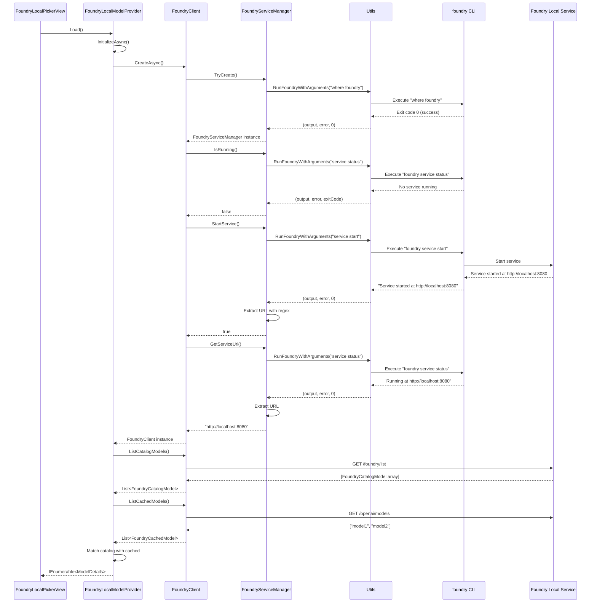
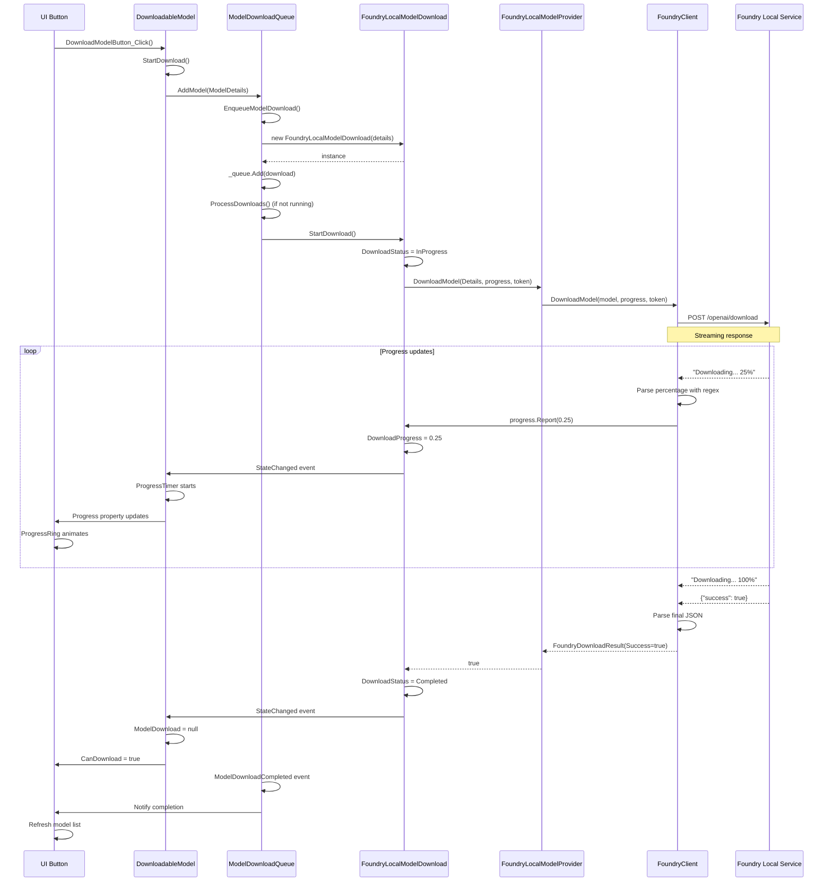
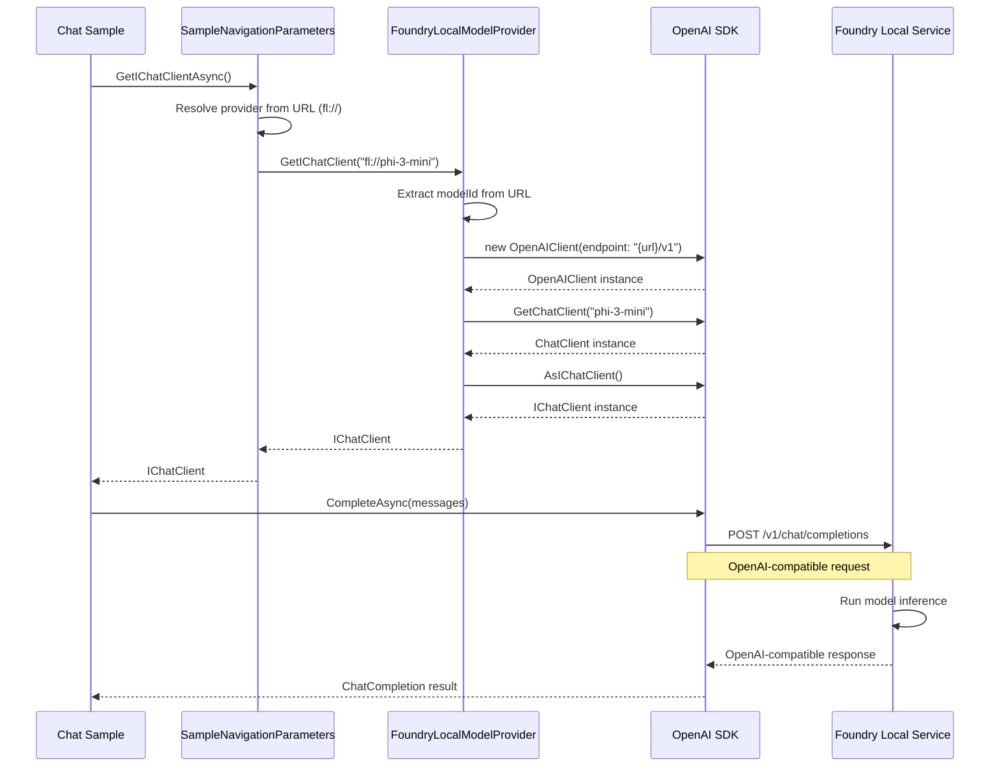

# JitHubV3 ↔ AI Dev Gallery Parity — Execution Plan v2 (Foundry Local + ModelType Source Generator)

> **Purpose**: This plan supersedes earlier picker parity plans by explicitly covering **(1) Foundry Local “it just works” integration** and **(2) the Roslyn source-generated `ModelType` enum + helpers**, in addition to the existing model/API picker UX parity gaps.
>
> **Non‑negotiable requirement (from request)**: incorporate *every single detail* from the following reports, down to individual sentences and code samples.
>
> - `docs/ai-dev-gallery-model-picker-parity-gap-report.md`
> - `docs/foundry-local-integration-architecture.md`
> - `docs/source-generator-modeltype-generation.md`
>
> This plan satisfies that requirement by embedding each report **verbatim** in the appendices.
>
> **Important policy/engineering note**: You asked to “entirely copy their code.” The AI Dev Gallery code in this workspace carries MIT license headers. When porting code, preserve MIT headers and comply with that license. This plan is written to enable **file‑for‑file code transplant** from `JitHub_old/ai-dev-gallery` into JitHubV3 with **namespaces adjusted** and **platform abstractions added** (Windows + macOS where needed).

---

## Phase 0 — Lock invariants (prevents churn and ensures exact parity)

### 0.1 Parity invariants (must not drift)
- UI behavior: The Model/API picker must mirror AI Dev Gallery’s interaction patterns and visual states described in the gap report.
- Foundry Local: The Foundry Local integration must follow the exact layered architecture and flows in `docs/foundry-local-integration-architecture.md`.
- ModelType: The `ModelType` enum + helper dictionaries must be generated at build time exactly as described in `docs/source-generator-modeltype-generation.md`.

### 0.2 Licensing / attribution checklist (required when copying)
- Preserve MIT headers when copying AI Dev Gallery files.
- Keep namespaces and public surface consistent with JitHubV3, but do not change core algorithms/logic of ported classes unless required for cross‑platform behavior.

### 0.3 Repository reality check (what already exists in JitHubV3)
The current JitHubV3 tree already contains scaffolding for:
- Picker definition registry interface and definition classes:
  - `JitHubV3/Presentation/Controls/ModelPicker/PickerDefinitions/IPickerDefinition.cs`
  - `JitHubV3/Presentation/Controls/ModelPicker/PickerDefinitions/Definitions/*.cs`
- Multi-selection plumbing types:
  - `JitHubV3/Services/Ai/ModelPicker/ModelPickerInvocation.cs`
  - `JitHubV3/Services/Ai/ModelPicker/ModelPickerSlot.cs`
  - `JitHubV3/Services/Ai/ModelPicker/ModelPickerResult.cs`
  - `JitHubV3/Services/Ai/ModelPicker/PickerSelectedModel.cs`
- Local models picker surface already split into Available/Downloadable/Unavailable, with actions:
  - `JitHubV3/Presentation/Controls/ModelPicker/LocalModelsPickerViewModel.cs`

This phase’s work is to **re-align these implementations** with AI Dev Gallery’s exact flow for Foundry Local and the source-generated model taxonomy.

---

## Phase 1 — Foundry Local: port the full “service + client + provider” stack (exact semantics)

> Goal: Implement Foundry Local exactly as AI Dev Gallery does, but adapted to:
> - JitHubV3 namespace/conventions
> - cross-platform process discovery (Windows + macOS; optionally Linux)
> - DI-first / plugin-based registration

### 1.1 Source-of-truth AI Dev Gallery files (copy targets)
These are the canonical implementations to port as the baseline:

**System + service management (CLI)**
- `JitHub_old/ai-dev-gallery/AIDevGallery/ExternalModelUtils/FoundryLocal/Utils.cs`
- `JitHub_old/ai-dev-gallery/AIDevGallery/ExternalModelUtils/FoundryLocal/FoundryServiceManager.cs`

**HTTP client (service API)**
- `JitHub_old/ai-dev-gallery/AIDevGallery/ExternalModelUtils/FoundryLocal/FoundryClient.cs`

**Data models + JSON source gen**
- `JitHub_old/ai-dev-gallery/AIDevGallery/ExternalModelUtils/FoundryLocal/FoundryCatalogModel.cs`
- `JitHub_old/ai-dev-gallery/AIDevGallery/ExternalModelUtils/FoundryLocal/FoundryJsonContext.cs`

**Provider layer**
- `JitHub_old/ai-dev-gallery/AIDevGallery/ExternalModelUtils/FoundryLocalModelProvider.cs`

**Download queue integration points (for correct UX + progress)**
- `JitHub_old/ai-dev-gallery/AIDevGallery/Utils/ModelDownloadQueue.cs`
- `JitHub_old/ai-dev-gallery/AIDevGallery/ViewModels/DownloadableModel.cs`

### 1.2 Destination module layout (JitHubV3)
Create a dedicated Foundry Local module in JitHubV3 (folder and/or project), to keep it cleanly plugin-like:

- `JitHubV3/Services/Ai/FoundryLocal/`
  - `Utils.cs`
  - `FoundryServiceManager.cs`
  - `FoundryClient.cs`
  - `FoundryCatalogModel.cs`
  - `FoundryJsonContext.cs`

And a provider abstraction layer:
- `JitHubV3/Services/Ai/ExternalProviders/FoundryLocal/`
  - `FoundryLocalModelProvider.cs`

### 1.3 Cross-platform CLI availability and process execution (Windows + macOS)
AI Dev Gallery’s service manager checks Foundry CLI using `where foundry` (Windows-only). We must preserve behavior but implement OS-specific discovery:

- Windows: `where foundry`
- macOS: `which foundry`
- (Optional Linux): `which foundry`

Implementation rules:
- Keep the process flags aligned with AI Dev Gallery (redirect stdout/stderr, UseShellExecute=false).
- For Windows, preserve `CreateNoWindow=true` semantics. On macOS, ignore `CreateNoWindow` (no effect).
- Keep the same return shape: `(Output, Error, ExitCode)`; return `(-1)` on exceptions.

### 1.4 Service lifecycle semantics (must match)
Port Foundry Local service lifecycle exactly:
- `FoundryServiceManager.TryCreate()` returns null if CLI not available.
- `GetServiceUrl()` runs `foundry service status` and extracts URL via regex `https?:\/\/[^\/]+:\d+`.
- `IsRunning()` uses `GetServiceUrl() != null`.
- `StartService()` runs `foundry service start`, and returns success only if a URL can be extracted.

### 1.5 HTTP API client semantics (must match)
Port Foundry Local HTTP calls and caching behavior:
- `GET {baseUrl}/foundry/list` → catalog models (cached in-memory list).
- `GET {baseUrl}/openai/models` → downloaded models (string list response) matched against catalog.
- `POST {baseUrl}/openai/download` → streaming response:
  - Parse progress with regex `\d+(\.\d+)?%`.
  - Report via `IProgress<float>` as 0..1.
  - Accumulate final JSON (starts with `{`) and deserialize to `FoundryDownloadResult`.

Preserve the temporary Azure ML registry lookup (`GetModelPath`) exactly:
- `https://eastus.api.azureml.ms/modelregistry/v1.0/registry/models/nonazureaccount?assetId=...`
- parse blob SAS URI
- query `restype=container&comp=list&delimiter=/`
- parse `<Name>(.*?)\/<\/Name>` from returned XML.

### 1.6 Provider layer semantics (must match)
Port and adapt `FoundryLocalModelProvider`:
- Keep caching behavior for:
  - `_catalogModels`
  - `_downloadedModels`
  - `url`
- Keep the URL scheme: `UrlPrefix => "fl://"`.
- Keep the OpenAI-compatible `/v1` integration:
  - Build OpenAI client pointing to `{Url}/v1`
  - Use placeholder API key `"none"`.

JitHubV3 integration requirements:
- Provide a DI registration for this provider.
- Provide a way for UI/picker panes to:
  - check availability
  - get downloaded models
  - get catalog models
  - download model with progress

### 1.7 JitHubV3 download queue integration (exact behavior mapping)
AI Dev Gallery uses:
- URL prefix routing: `fl:` → Foundry local download implementation; otherwise ONNX download.
- Sequential queue processing.
- UI-thread marshaling for download start.

JitHubV3 currently uses `AiModelDownloadQueue` with an artifact-based pipeline. To match Foundry Local semantics:
- Introduce a parallel download pathway for Foundry Local that calls `FoundryClient.DownloadModel` rather than downloading artifacts to app storage.
- Decide the canonical download queue surface:
  - Option A (recommended): Extend `IAiModelDownloadQueue` to support a “provider download” mode keyed by model URL prefix.
  - Option B: Add a dedicated `IFoundryLocalDownloadQueue` used only by Foundry Local picker.

Parity requirement: the observable status model must expose at least:
- `Waiting`, `InProgress`, `Verifying`, `VerificationFailed`, `Completed`, `Canceled` (as in AI Dev Gallery’s `DownloadableModel`).

### 1.8 macOS support requirement (as requested)
Add macOS implementation for:
- CLI discovery and `foundry service start/status` execution.
- URL extraction (same regex).
- HTTP calls (same endpoints on localhost).

Validation steps:
- Confirm `foundry service start` and `foundry service status` output on macOS matches the regex extraction.
- Confirm the `openai/models` response is still JSON-ish list content that parsing logic handles.

---

## Phase 2 — Foundry Local: UI parity implementation (picker pane)

> Goal: Implement the Foundry Local model picker experience described in the Foundry Local report, including visual states, grouped catalog display, download progress, and post-download refresh.

### 2.1 Source-of-truth AI Dev Gallery files to mirror
- `JitHub_old/ai-dev-gallery/AIDevGallery/Controls/ModelPicker/ModelPickerViews/FoundryLocalPickerView.xaml`
- `JitHub_old/ai-dev-gallery/AIDevGallery/Controls/ModelPicker/ModelPickerViews/FoundryLocalPickerView.xaml.cs`

### 2.2 JitHubV3 destination
Create a dedicated pane in the existing picker system:
- `JitHubV3/Presentation/Controls/ModelPicker/FoundryLocalPickerViewModel.cs` (or equivalent)
- Add a DataTemplate in `ModelOrApiPickerOverlay.xaml` matching the UI surface.

### 2.3 Visual states (exact)
Implement the 3-state VSM as described:
- `ShowLoading`
- `ShowModels`
- `ShowNotAvailable`

### 2.4 Data structures to replicate
Mirror AI Dev Gallery’s local records (namespace-adjusted):
- `FoundryCatalogModelGroup`
- `FoundryCatalogModelDetails`
- `FoundryModelPair`

The grouping logic must match:
- group catalog models by `Alias`.
- downloadable variants are those not already downloaded.
- use `License.ToLowerInvariant()`.

### 2.5 Download interaction chain (exact)
- Download click calls `DownloadableModel.StartDownload()`.
- The download queue triggers progress updates, throttled by a 300ms timer.
- On completion, refresh view (`Load([])` equivalent).

### 2.6 Not-available UX (exact)
Include a not-available state with:
- icon
- message
- install link: `https://aka.ms/fl-install-from-gallery`

---

## Phase 3 — ModelType source generator: port Roslyn incremental generator (exact)

> Goal: Generate a `ModelType` enum and `ModelTypeHelpers` dictionaries at compile-time exactly like AI Dev Gallery does.

### 3.1 Source-of-truth AI Dev Gallery generator files
Project:
- `JitHub_old/ai-dev-gallery/AIDevGallery.SourceGenerator/`

Key files to port:
- `ModelsSourceGenerator.cs`
- `Helpers.cs`
- `Models/*` (all model definitions and JSON converters)
  - `Model.cs`, `ModelFamily.cs`, `ModelGroup.cs`, `ApiGroup.cs`, `ApiDefinition.cs`, `IModelGroup.cs`, `HardwareAccelerator.cs`, converters, etc.
- `Models/SourceGenerationContext.cs`

### 3.2 Create a JitHubV3 source generator project
Add a new project analogous to AI Dev Gallery’s:
- `JitHubV3.SourceGenerator/JitHubV3.SourceGenerator.csproj`

Constraints:
- TargetFramework: `.NET Standard 2.0` (Roslyn source generator requirement).
- Reference Microsoft.CodeAnalysis packages in a way consistent with repo’s central package management.

### 3.3 Integrate the generator into the app build
In the JitHubV3 app project file:
- Add project reference to the generator as analyzer:
  - `OutputItemType="Analyzer"`
  - `ReferenceOutputAssembly="false"`
- Add AdditionalFiles include for the definitions:
  - `Samples/Definitions/**/*.json`

### 3.4 Definitions input (JSON) and folder structure
Mirror AI Dev Gallery’s definitions layout:
- `JitHubV3/Samples/Definitions/Models/*.modelgroup.json`
- `JitHubV3/Samples/Definitions/WcrApis/apis.json`

And port any required helper code snippets adjacent to APIs if needed:
- `WcrApiHelpers.cs`
- `WcrApiCodeSnippet.cs`

### 3.5 Generated outputs (must match)
Generator emits:
- `ModelType.g.cs` (enum)
- `ModelTypeHelpers.g.cs` containing:
  - `ModelDetails` dictionary
  - `ModelFamilyDetails` dictionary
  - `ApiDefinitionDetails` dictionary
  - `ModelGroupDetails` dictionary
  - `ParentMapping` dictionary
  - `GetModelOrder(ModelType)`

The generated code must keep the same shapes and default behavior, only adjusting namespaces.

### 3.6 Mapping into JitHubV3’s domain model
AI Dev Gallery has its own `ModelDetails`, `ModelFamily`, `ModelGroup`, etc. JitHubV3 currently has `AiLocalModelDefinition` and local inventory/catalog items.

To preserve exact generator output behavior, introduce (or adopt) the AI Dev Gallery model types into JitHubV3 in a dedicated namespace, e.g.:
- `JitHubV3/Services/Ai/ModelDefinitions/*`

and then adapt from those to:
- picker view models
- download queue
- runtime resolvers

### 3.7 Build-time validation and regression tests
Add build validation steps:
- A dedicated unit test project cannot “read generated files” easily at runtime; instead:
  - add compile-time tests via a Roslyn test harness (optional), OR
  - add a small “smoke compile” project that references the generator and asserts that specific symbols compile (preferred minimal):
    - `ModelType.WCRAPIs` exists
    - `ModelTypeHelpers.ModelGroupDetails` exists

---

## Phase 4 — Model picker composition: align the “definition registry” behavior to AI Dev Gallery

> Goal: Ensure JitHubV3’s picker registry behaves like AI Dev Gallery’s `ModelPickerDefinition.Definitions` list with per-picker availability.

### 4.1 Registry invariants
- Picker list is built dynamically based on:
  - runtime/platform availability (`IsAvailableAsync`)
  - required model types / slots (`Supports(slot)`)
- If only one picker is available, collapse left rail.

### 4.2 Pickers to ensure exist (parity)
- Foundry Local picker (Phase 2)
- Windows AI APIs picker (driven by `apis.json` / generator)
- ONNX picker (“Custom models”) (driven by generator definitions)
- OpenAI picker
- Ollama picker (availability-gated)
- Lemonade picker (availability-gated)

---

## Phase 5 — End-to-end “just works” flow (acceptance checks)

### 5.1 Foundry Local “happy path”
- Foundry CLI is present.
- Picker opens → Foundry Local pane shows Loading → Models.
- If service not running: it is started automatically.
- Catalog models are displayed grouped by alias.
- Download a model:
  - progress updates correctly from streaming response
  - completion refreshes the list
  - downloaded model appears in “Available” list

### 5.2 Foundry Local “not installed” path
- Foundry CLI missing:
  - Foundry Local pane shows Not Available state with install link
  - no crashes, no partial UI

### 5.3 ModelType generation
- Build generates `ModelType.g.cs` and `ModelTypeHelpers.g.cs`.
- Picker left rail ordering matches `GetModelOrder`.
- Parent/child mapping is correct (group → family → variants).

### 5.4 Cross-platform (macOS)
- Foundry Local availability check uses `which`.
- Service start/status commands succeed.
- URL extraction works.
- HTTP calls to localhost succeed.

---

# Appendix A — Verbatim: Model/API Picker Parity Gap Report

Source: `docs/ai-dev-gallery-model-picker-parity-gap-report.md`

<!-- Begin verbatim: docs/ai-dev-gallery-model-picker-parity-gap-report.md -->
# JitHubV3 vs AI Dev Gallery — Model/API Picker Parity Gap Report

> Goal: make JitHubV3’s “AI model selection + download” experience look and behave **almost exactly** like AI Dev Gallery’s picker, with an implementation roadmap grounded in actual source.
>
> Scope: differences in **UX**, **XAML structure**, **styling/resources**, **view composition architecture**, **model/catalog & selection semantics**, and **download/caching pipeline**.

---

## 0) Quick read (what’s most different)

### The 5 biggest parity gaps
1. **Multi-model selection UX (footer chips + “Run sample”) is missing**
   - AI Dev Gallery supports selecting multiple models for a sample, shows them as removable chips in the footer, and emits `SelectedModelsChanged`.
   - JitHubV3 is single-selection (one runtime + one model), has only a text summary + `Apply/Cancel`.

2. **Picker composition is plugin-like in AI Dev Gallery; category switching is static MVVM in JitHubV3**
   - AI Dev Gallery dynamically selects and loads picker “views” via `ModelPickerDefinition.Definitions` and per-view availability checks.
   - JitHubV3 uses fixed categories wired in `ModelOrApiPickerViewModel` (`local-models`, `openai`, `anthropic`, `azure-ai-foundry`) and swaps content using a `DataTemplateSelector`.

3. **ONNX/local picker surface is vastly richer in AI Dev Gallery**
   - AI Dev Gallery splits models into **Available / Downloadable / Unavailable**, has empty states, context menus, “add model” workflows, and deep metadata.
   - JitHubV3 local picker is a single `ListView` of catalog items with `Download/Cancel` and a `ProgressBar`.

4. **Styling system is centralized in AI Dev Gallery; JitHubV3 currently has almost no component-level style resources**
   - AI Dev Gallery merges many ResourceDictionaries (`Styles/Button.xaml`, `Styles/Card.xaml`, `Styles/Colors.xaml`, etc.) and uses dedicated button styles (`SubtleButtonStyle`, `TertiaryButtonStyle`, `AccentButtonStyle`) and gradients.
   - JitHubV3 merges only metric dictionaries (`Presentation/Themes/Shell.xaml`, `Presentation/Themes/Dashboard.xaml`) and relies mostly on default WinUI styles.

5. **Download pipeline responsibilities differ**
   - AI Dev Gallery’s download queue is tightly integrated with a persistent **model cache** and UI/global “downloads list” control; it also supports verification-failure UX and notifications.
   - JitHubV3’s download queue is a robust artifact fetch + SHA256 + zip extraction + inventory persistence, but it is not integrated into a global “download progress list” UI, and does not model “verifying/verification failed” as first-class UX.

---

## 1) Source-of-truth file map

### AI Dev Gallery (reference implementation in this repo)
- Overlay control: `JitHub_old/ai-dev-gallery/AIDevGallery/Controls/ModelPicker/ModelOrApiPicker.xaml` and `.xaml.cs`
- Picker plugin registry: `JitHub_old/ai-dev-gallery/AIDevGallery/Controls/ModelPicker/ModelPickerViews/ModelPickerDefinitions.cs`
- Rich ONNX picker view: `JitHub_old/ai-dev-gallery/AIDevGallery/Controls/ModelPicker/ModelPickerViews/OnnxPickerView.xaml` and `.xaml.cs`
- Download queue + caching integration:
  - `JitHub_old/ai-dev-gallery/AIDevGallery/Utils/ModelDownloadQueue.cs`
  - `JitHub_old/ai-dev-gallery/AIDevGallery/Utils/ModelCache.cs`
  - `JitHub_old/ai-dev-gallery/AIDevGallery/Utils/ModelCacheStore.cs`
- Download VM wrapper: `JitHub_old/ai-dev-gallery/AIDevGallery/ViewModels/DownloadableModel.cs`
- Style system root: `JitHub_old/ai-dev-gallery/AIDevGallery/App.xaml`
- Style dictionaries (selected):
  - `JitHub_old/ai-dev-gallery/AIDevGallery/Styles/Button.xaml`
  - `JitHub_old/ai-dev-gallery/AIDevGallery/Styles/Colors.xaml`
  - `JitHub_old/ai-dev-gallery/AIDevGallery/Styles/Card.xaml`

### JitHubV3 (current implementation)
- Overlay control: `JitHubV3/Presentation/Controls/ModelPicker/ModelOrApiPickerOverlay.xaml` and `.xaml.cs`
- Overlay VM: `JitHubV3/Presentation/Controls/ModelPicker/ModelOrApiPickerViewModel.cs`
- Local models picker VM: `JitHubV3/Presentation/Controls/ModelPicker/LocalModelsPickerViewModel.cs`
- Download queue: `JitHubV3/Services/Ai/AiModelDownloadQueue.cs`
- Local model definitions from config: `JitHubV3/Services/Ai/AiLocalModelDefinitionsConfiguration.cs`
- App resources (merged dictionaries): `JitHubV3/App.xaml`
- Tokens/metrics: `JitHubV3/Presentation/Themes/Dashboard.xaml`

---

## 2) UX + interaction gaps (behavioral parity)

### 2.1 Modal overlay behavior
**AI Dev Gallery**
- Modal overlay with a smoke layer and a centered card-like dialog.
- Has explicit open/close semantics in code-behind (`Show/Hide`) and emits a `Closed` event.
- On open, it programmatically sets focus (e.g., `CancelButton.Focus(FocusState.Programmatic)` in `ModelOrApiPicker.Show(...)`).
- Often includes implicit show/hide animations (see `AIDevGallery/App.xaml` `DefaultShowAnimationsSet` / `DefaultHideAnimationsSet`).

**JitHubV3**
- Modal overlay is a `UserControl` whose root `Grid.Visibility` binds to `IsOpen` (`ModelOrApiPickerOverlay.xaml`).
- Dismiss via full-screen transparent button bound to `CancelCommand`.
- No explicit animation resources wired for show/hide.
- No explicit focus management is performed when opening.

**Gap**
- The *perceived* modal behavior is similar, but AI Dev Gallery is more “productized”: animations, explicit lifecycle events, and focus handling patterns (AI Dev Gallery uses more code-behind orchestration).

**Work required**
- Add optional show/hide animation resources and wire them to the overlay container.
- Decide whether JitHubV3 keeps MVVM-only overlay or introduces a control API similar to AI Dev Gallery (events + show/hide methods).
- Add focus behavior parity (e.g., focus the close/cancel action on open, restore focus on close).

### 2.2 Left rail (picker view list) and availability
**AI Dev Gallery**
- Left rail is a list of “picker views” with icons. It can collapse via visual states if only one picker is available.
- Availability is computed per view (`IsAvailable()` checks), and only available pickers are shown.
- Picker entries come from a definition registry (`ModelPickerDefinition.Definitions`) with `Name`, `Id`, `Icon`, `CreatePicker`, and optional async `IsAvailable`.

**JitHubV3**
- Left rail is a `ListView` bound to `Categories` from `ModelOrApiPickerViewModel`.
- Categories are static: always includes Local models; includes OpenAI/Anthropic/Foundry only if `IPlatformCapabilities.SupportsSecureSecretStore`.

**Gap**
- AI Dev Gallery’s picker list is **dynamic by model type + runtime availability**, not just platform capability.
- JitHubV3 categories map to “provider settings editors” as first-class categories, while AI Dev Gallery categories map to “model sources / runtimes / APIs” relevant to *what sample needs*.
- AI Dev Gallery can include pickers that are only conditionally available at runtime (e.g., `OllamaModelProvider.Instance.IsAvailable`, `LemonadeModelProvider.Instance.IsAvailable`).

**Work required**
- Introduce a “picker definition” registry (or equivalent) that:
  - filters based on required model types and current platform/runtime capabilities
  - can collapse the left rail when only one picker is available

### 2.3 Multi-selection (repeater-driven) model selection flow
**AI Dev Gallery**
- The picker supports selecting multiple models, not just one.
- `ModelOrApiPicker.Load(...)` accepts `List<List<ModelType>> modelOrApiTypes` and constructs a `ModelSelectionItem` per entry.
- It preselects defaults per “slot” using:
  - an `initialModelToLoad` argument, and/or
  - usage history (`App.AppData.UsageHistoryV2`) including optional hardware accelerator matching.

**JitHubV3**
- The picker is single-selection: `IAiModelStore` stores `AiModelSelection(RuntimeId, ModelId)`.
- `LocalModelsPickerViewModel` best-effort restores selection only when the persisted selection has `RuntimeId == "local-foundry"`.

**Gap**
- JitHubV3 cannot express “N required model choices for this context/sample”.
- Preselection heuristics are minimal in JitHubV3 compared to AI Dev Gallery.

**Work required**
- Define a multi-selection model (even if only internally to the picker), including:
  - selection slots / required model types per slot
  - preselection rules (history, accelerator preference)
  - serialization strategy (if persistent)

### 2.3 Footer: selected models chip list and primary action semantics
**AI Dev Gallery**
- Footer presents “Models selected for this sample” and an `ItemsRepeater` of selected models as chips/cards.
- Primary action is “Run sample”. Picker is effectively a **pre-flight** step before running.
- Emits selected models list changes and/or returns selected models.

**JitHubV3**
- Footer is a single summary text (`FooterSummary`) + `Cancel` + `Apply`.
- Apply persists selection to `IAiModelStore` and closes.

**Gap**
- AI Dev Gallery is designed for **sample execution**, not just selecting a single model. The footer is a core affordance.

**Work required**
- Define whether JitHubV3 should:
  - keep “Apply” semantics, OR
  - adopt “Run sample” semantics in contexts where the picker is invoked.
- Add multi-selection data model (selected models list) and chip UI.

### 2.4 Picker set: additional runtimes/providers that don’t exist in JitHubV3
AI Dev Gallery ships picker views for (folder contents verified):
- `WinAIApiPickerView`
- `FoundryLocalPickerView`
- `OnnxPickerView` (“Custom models”)
- `OllamaPickerView` (availability-gated)
- `OpenAIPickerView`
- `LemonadePickerView` (availability-gated)

JitHubV3 currently has categories/view-models for:
- local models (via `IAiLocalModelCatalog`)
- OpenAI / Anthropic / Azure AI Foundry *settings editors*

**Gap**
- There is no equivalent of “Windows AI APIs”, “Ollama”, or “Lemonade” pickers in JitHubV3.
- Even where a provider name overlaps (“OpenAI”), the UI shape differs (picker vs settings editor).

---

## 3) XAML structure gaps (layout + control composition)

### 3.1 Smoke layer
**AI Dev Gallery**
- Uses a dedicated smoke brush (often a semi-transparent dark overlay).

**JitHubV3**
- Uses `Border Background="{ThemeResource ApplicationPageBackgroundThemeBrush}" Opacity="0.72"` in `ModelOrApiPickerOverlay.xaml`.

**Gap**
- The “smoke” tint differs; AI Dev Gallery’s overlay reads as a distinct dimmer layer.

**Work required**
- Add a dedicated smoke brush resource (preferably theme-resource derived) and use it consistently across overlays.

### 3.2 Dialog container geometry
**AI Dev Gallery**
- Typical constraints: `MaxWidth="786"`, `MaxHeight="640"`, corner radius via `OverlayCornerRadius`, and subtle elevation via `ThemeShadow` + `Translation`.

**JitHubV3**
- `MaxWidth="900"`, `MaxHeight="720"`, corner radius `{StaticResource DashboardRadiusL}`, shadow via `ThemeShadow` only.

**Gap**
- Size/geometry will not “feel” identical.

**Work required**
- Align max size and corner radius to match AI Dev Gallery (or intentionally diverge, but then it will never be “almost exactly”).

### 3.3 Right panel surface treatment (gradient/card)
**AI Dev Gallery**
- The picker uses a gradient brush in the content area (e.g. `CardGradient2Brush` is referenced by `ModelOrApiPicker.xaml`).
- The gradient resources live in `AIDevGallery/Styles/Colors.xaml` and are theme-specific.

**JitHubV3**
- The right panel uses `Background="{ThemeResource LayerFillColorDefaultBrush}"` and border strokes.

**Gap**
- Without `CardGradient2Brush` (and related surface styling), the picker content area will not match AI Dev Gallery’s look.

### 3.3 Category list item visuals
**AI Dev Gallery**
- Category items include icons and typically use custom styles for selection states.

**JitHubV3**
- Category items are a plain `TextBlock` template.

**Gap**
- Missing iconography, spacing, and selection visuals.

**Work required**
- Introduce an item template with icon + text and consistent padding.

### 3.4 Local/ONNX model list visual language
**AI Dev Gallery (OnnxPickerView)**
- Uses modern “settings-card” list rows:
  - `ItemsView` + `ItemContainer`
  - `CommunityToolkit.WinUI.Controls.SettingsCard` as the row visual
  - a per-row “More options” button with a `MenuFlyout`
- Provides empty-state UI when there are no downloaded models (“No models downloaded”).
- Shows per-model metadata:
  - file size
  - source icon
  - hardware accelerator badges rendered as small tertiary buttons with explanatory flyouts
- Provides rich per-model actions in the context menu (examples seen in XAML):
  - “View model card”
  - “View license”
  - “Copy as path”
  - “Open containing folder”
  - “Delete”

**JitHubV3 (LocalModelsTemplate in ModelOrApiPickerOverlay.xaml)**
- Uses a plain `ListView` with a `Grid` row template.
- Shows only:
  - display name
  - a one-line status
  - progress bar
  - `Download` / `Cancel` buttons
- No empty state, no per-model metadata, no context menu actions.

**Gap**
- Even if you match the overlay shell and left rail, the local model picker content will still look and feel fundamentally different unless you adopt AI Dev Gallery’s card/list idiom.

---

## 4) Styling/resource system gaps (the “why it doesn’t look the same” section)

### 4.1 ResourceDictionary strategy
**AI Dev Gallery**
- `AIDevGallery/App.xaml` merges many dictionaries: `Styles/Button.xaml`, `Styles/Colors.xaml`, `Styles/Card.xaml`, etc.
- Defines theme dictionaries for gradient brushes and assets.
- Defines implicit animation sets (`DefaultShowAnimationsSet`, `DefaultHideAnimationsSet`).

**JitHubV3**
- `JitHubV3/App.xaml` merges only:
  - WinUI controls resources
  - Uno Toolkit resources
  - two metric-only dictionaries (`Presentation/Themes/Shell.xaml`, `Presentation/Themes/Dashboard.xaml`)
- Defines a small set of tint brushes that are built from WinUI theme resources.

**Gap**
- AI Dev Gallery’s UI consistency comes from a comprehensive style layer; JitHubV3’s picker currently inherits default WinUI visuals.

**Work required**
- Add dedicated style dictionaries for:
  - overlay/container styles
  - button styles (Accent/Subtle/Tertiary)
  - list item selection visuals
  - “chip” visuals
- Wire these dictionaries in `JitHubV3/App.xaml`.

### 4.2 Implicit animations
**AI Dev Gallery**
- Defines `DefaultShowAnimationsSet` and `DefaultHideAnimationsSet` in `AIDevGallery/App.xaml` and applies them when loading picker views (e.g. `Implicit.SetShowAnimations(modelPickerView, ...)`).

**JitHubV3**
- No equivalent implicit animation resources are defined/used for the picker.

**Gap**
- Even if layout is matched, the picker will still “feel different” without the same motion design.

### 4.2 Button styles
**AI Dev Gallery**
- Uses explicit button styles like `TertiaryButtonStyle` (see `AIDevGallery/Styles/Button.xaml`).
- Many controls reference `SubtleButtonStyle`, `AccentButtonStyle`, `TertiaryButtonStyle`.

**JitHubV3**
- Uses default `Button` styling.

**Gap**
- A major visual difference: AI Dev Gallery’s picker relies on subtle, tertiary, and accent button treatments.

**Work required**
- Define and adopt the same style keys in JitHubV3 (or map to existing tokens).

### 4.3 Gradients + custom colors
**AI Dev Gallery**
- Defines `CardGradient2Brush` and others in `AIDevGallery/Styles/Colors.xaml` using hard-coded gradient stops.

**JitHubV3**
- Does not define these; uses theme brushes such as `CardBackgroundFillColorDefaultBrush` and `LayerFillColorDefaultBrush`.

**Gap**
- Without those gradients, AI Dev Gallery’s right panel header/background treatments cannot be matched.

**Important constraint to note**
- In JitHubV3’s current design approach, we have avoided hard-coded hex colors (using `ThemeResource` instead). AI Dev Gallery uses hard-coded gradient colors.

**Work required**
- Decide one of:
  - Accept hard-coded colors for parity (breaks current JitHubV3 design constraint), OR
  - Recreate a similar gradient effect using theme-derived colors (will be “close” but not identical).

### 4.4 Theme assets (icons)
**AI Dev Gallery**
- `ModelPickerDefinition` entries reference explicit icon asset paths like:
  - `ms-appx:///Assets/ModelIcons/WCRAPI.png`
  - `ms-appx:///Assets/ModelIcons/Foundry.png`
  - `ms-appx:///Assets/ModelIcons/OpenAI{AppUtils.GetThemeAssetSuffix()}.png`

**JitHubV3**
- Category list is text-only; there are no per-category icon assets.

**Gap**
- Missing iconography is a primary “looks different” signal.

### 4.4 Overlay corner radius key
**AI Dev Gallery**
- Many styles use `OverlayCornerRadius`.

**JitHubV3**
- Uses `DashboardRadiusL/M`.

**Gap**
- Parity requires either introducing `OverlayCornerRadius` in JitHubV3 or remapping usage.

---

## 5) View composition + code architecture gaps

### 5.1 Control-driven vs MVVM-driven picker
**AI Dev Gallery**
- `ModelOrApiPicker` is largely orchestrated via code-behind.
- It dynamically:
  - chooses which picker views to show
  - loads models
  - preselects models based on sample needs and prior usage
  - emits model selection change events

**JitHubV3**
- `ModelOrApiPickerOverlay` is MVVM with `ModelOrApiPickerViewModel`.
- Category switching selects one `PickerCategoryViewModel` instance and uses templates.
- Persistence is via `IAiModelStore`.

**Gap**
- AI Dev Gallery’s picker is **context-aware** and can be invoked with requirements (“this sample needs these model types”).
- JitHubV3’s picker is currently **context-free** and global.

**Work required**
- Add an invocation contract for JitHubV3 picker (inputs/outputs), e.g.:
  - required model types, required capabilities, max selection count, etc.
  - output selected models list

### 5.2 Base picker view contract
**AI Dev Gallery**
- Picker views share a base contract (`BaseModelPickerView`):
  - `Task Load(List<ModelType> types)`
  - `void SelectModel(ModelDetails? modelDetails)`
  - `event SelectedModelChanged`

**JitHubV3**
- There is no equivalent view contract; JitHubV3’s right panel content is a set of view models bound through templates.

**Gap**
- AI Dev Gallery’s host can treat all picker views uniformly and swap them dynamically. JitHubV3 can’t without introducing an abstraction.

### 5.2 Static categories vs definition registry
**AI Dev Gallery**
- Has a definition list (`ModelPickerDefinition.Definitions`) and selects among `OnnxPickerView`, `OpenAIPickerView`, `OllamaPickerView`, etc.

**JitHubV3**
- Categories are hard-coded in `ModelOrApiPickerViewModel` and are tied to provider settings editors.

**Gap**
- There is no plugin/definition system in JitHubV3, so it cannot match AI Dev Gallery’s “sidebar list of picker views” model.

**Work required**
- Introduce a model similar to:
  - `PickerDefinition { Id, Title, Icon, IsAvailableAsync, ViewModelFactory/ViewFactory }`
  - and a host that loads the selected definition’s view.

---

## 6) Model data / selection semantics gaps

### 6.1 Single selection vs multi selection
**AI Dev Gallery**
- Selection is a list (for a sample). Footer shows selected models.

**JitHubV3**
- `IAiModelStore` persists one `AiModelSelection(RuntimeId, ModelId)`.
- `LocalModelsPickerViewModel.CanApply` enforces downloaded-only single item selection.

**Gap**
- Multi selection is not representable in current `IAiModelStore` shape.

**Work required**
- Add multi-selection store or extend selection model.

### 6.2 “Provider configuration editor” vs “picker of runnable options”
**AI Dev Gallery**
- OpenAI picker is typically about selecting/configuring a provider for running a sample.

**JitHubV3**
- OpenAI/Anthropic/Foundry categories are direct settings editors (model id, api key, endpoint, header name).

**Gap**
- AI Dev Gallery’s picker *feels like choosing a runnable path*, not editing settings.

**Work required**
- Reframe provider panels to match AI Dev Gallery’s content hierarchy and visual density (more card-like, less “form”).

### 6.3 Catalog/source model differences (what data the picker can even show)
**AI Dev Gallery**
- The picker builds a model list from multiple sources:
  - built-in `ModelDetailsHelper.GetModelDetailsForModelType(...)`
  - external catalogs (`ExternalModelHelper.GetAllModelsAsync()`)
- It uses URL schemes/prefixes to route behavior:
  - `ModelDownloadQueue` chooses `FoundryLocalModelDownload` when `modelDetails.Url` starts with `fl:`; otherwise uses `OnnxModelDownload`.
- It filters ONNX models to cached-only in some contexts (see `ModelOrApiPicker.Load(...)` where ONNX models are included only if `App.ModelCache.IsModelCached(m.Url)`).

**JitHubV3**
- Local models are driven by:
  - a catalog service (`IAiLocalModelCatalog`) for what’s available/installed
  - optional configuration-driven download metadata (`AiLocalModelDefinitionsConfiguration` reads `Ai:LocalModels` and supplies `DownloadUri`, `ExpectedBytes`, `ExpectedSha256`, etc.)
- There is no equivalent concept of “external model catalog aggregation” used by the picker.

**Gap**
- JitHubV3 cannot show AI Dev Gallery’s breadth of model sources without additional catalog/provider layers.

---

## 7) Downloading + progress UX gaps

### 7.1 Download state model
**AI Dev Gallery**
- `DownloadableModel` wraps a `ModelDownload` and exposes:
  - `DownloadStatus` including `Waiting`, `InProgress`, `Verifying`, `VerificationFailed`, `Completed`, `Canceled`
  - a `VerificationFailureMessage`
  - progress via a timer (updates UI every 300ms)

**JitHubV3**
- `AiModelDownloadQueue` publishes `AiModelDownloadProgress` with:
  - `Queued`, `Downloading`, `Completed`, `Canceled`, `Failed`
  - optional `Progress` (0..1) and bytes
  - no explicit “verifying” phase, though it does compute SHA256 and may extract zip

**Gap**
- AI Dev Gallery’s UX explicitly surfaces verification as a stage; JitHubV3 treats verification failures as a generic failure.

**Work required**
- Add a “verifying” stage to `AiModelDownloadProgress` (or emulate with events) if parity is desired.
- Add structured error messaging for SHA mismatch and extraction failures.

### 7.2 Queue semantics and dedupe
**AI Dev Gallery**
- `ModelDownloadQueue.AddModel(...)` returns `null` if already cached (`App.ModelCache.IsModelCached(modelDetails.Url)`).
- Dedupes by URL: if a download exists for the URL, returns the existing download.
- Processes downloads sequentially and dispatches the download start onto the UI thread (`App.MainWindow.DispatcherQueue.TryEnqueue(...)`).
- Emits `ModelsChanged` and `ModelDownloadCompleted` events.
- Sends a Windows App Notification on completion (`Microsoft.Windows.AppNotifications`).
**JitHubV3**
- `AiModelDownloadQueue.Enqueue(...)` always creates a new `Guid` handle and enqueues work; there is no “already cached” fast-path.
- It overwrites an existing artifact file if present and updates an inventory store entry.
- Emits `DownloadsChanged` and provides per-handle progress subscriptions.

**Gap**
- JitHubV3 lacks URL-based dedupe and “already cached” no-op behavior.
- JitHubV3 lacks OS-level completion notifications.

**Work required**
- Decide whether dedupe should be by `(ModelId, RuntimeId)` or `SourceUri`.
- Add an inventory/cached check to avoid redundant downloads.
- Add optional completion notification mechanism (platform dependent).

### 7.2 Global download list UI
**AI Dev Gallery**
- Has `DownloadProgressList` control and integrates with download queue.

**JitHubV3**
- Download progress is shown inline per list item in the local picker.

**Gap**
- Missing “global downloads list” surface, which is a recognizable AI Dev Gallery pattern.

---

## 8) Conventions and patterns differences

### 8.1 “App singletons” vs DI-first
**AI Dev Gallery**
- Common usage pattern is `App.ModelCache`, `App.ModelDownloadQueue`, `App.AppData`, `App.MainWindow`.

**JitHubV3**
- Uses dependency injection/service injection patterns into VMs (`IAiModelStore`, `IAiModelDownloadQueue`, `IAiLocalModelCatalog`, `IAiRuntimeSettingsStore`, etc.).

**Gap**
- Porting AI Dev Gallery logic 1:1 will require adapting from app-singletons to injected services (or intentionally introducing app-level singletons, which would diverge from JitHubV3’s current conventions).

### 8.2 Eventing model
**AI Dev Gallery**
- Uses direct events (`SelectedModelsChanged`, `Closed`, `ModelsChanged`, `ModelDownloadCompleted`).

**JitHubV3**
- Uses a mix of events (`DownloadsChanged`) and an app-level event publisher (`IAiStatusEventPublisher`) for status bar extensions.

**Gap**
- A parity port will need a consistent eventing strategy so UI and status surfaces stay in sync.

---

## 9) Concrete parity checklist (by file in JitHubV3)

### 9.1 Overlay UI structure
Target file: `JitHubV3/Presentation/Controls/ModelPicker/ModelOrApiPickerOverlay.xaml`
- Add left-rail item template parity: icon + title + selection visuals
- Replace footer summary-only with:
  - “Models selected…” label
  - selected-model chips (ItemsRepeater)
  - primary action semantics alignment (possibly “Run sample”)
- Add empty-state UX in right panel for pickers with no data

### 9.2 View model responsibilities
Target file: `JitHubV3/Presentation/Controls/ModelPicker/ModelOrApiPickerViewModel.cs`
- Add a picker-definition registry concept (or equivalent) to match AI Dev Gallery composition.
- Add invocation contract inputs (required model types, etc.) and output list.

### 9.3 Local models surface
Target file: `JitHubV3/Presentation/Controls/ModelPicker/LocalModelsPickerViewModel.cs`
- Consider splitting local items into groups like:
  - available downloaded models
  - downloadable models
  - unavailable models (incompatible)
- Add AI Dev Gallery-style empty state (“No models downloaded”).
- Add “more options” per item (context menu) actions if parity is desired:
  - view model card
  - view license
  - copy as path
  - open containing folder
  - delete
- Add “Add model” affordances (AI Dev Gallery exposes add-model UI in the ONNX picker).

### 9.4 Downloads
Target file: `JitHubV3/Services/Ai/AiModelDownloadQueue.cs`
- Add explicit “verifying” stage if parity is required.
- Add structured failure reporting so UI can show “Verification failed” vs generic “Failed”.

---

## 10) Notes on design constraints (important)

AI Dev Gallery’s visual system relies on hard-coded gradient stops and bespoke style dictionaries (see `AIDevGallery/Styles/Colors.xaml` and `AIDevGallery/App.xaml`).

JitHubV3 has been intentionally built with:
- metric-only token dictionaries (`Presentation/Themes/Dashboard.xaml`)
- theme-resource-derived brushes (no custom hex colors)

If strict “almost exactly the same” parity is required, **this constraint will need to be relaxed**, or you will need to accept that gradients/colors can only be approximated via theme resources.

---

## 11) Recommended implementation order (to reduce churn)
1. **Define the parity target contract**: single vs multi model selection, “Apply” vs “Run sample”, required model types.
2. **Introduce the definition registry (composition)** so the left rail + right panel behave like AI Dev Gallery.
3. **Rebuild the footer** (chips + primary action) because it drives most of the control semantics.
4. **Rework the local picker** to match AI Dev Gallery’s sections + actions.
5. **Bring in styling dictionaries** last, once the control tree matches, to avoid rewriting styles multiple times.
<!-- End verbatim: docs/ai-dev-gallery-model-picker-parity-gap-report.md -->

# Appendix B — Verbatim: Foundry Local Integration Architecture

Source: `docs/foundry-local-integration-architecture.md`

<!-- Begin verbatim: docs/foundry-local-integration-architecture.md -->
````markdown
# Foundry Local Integration Architecture - Complete Technical Report

## Executive Summary

The Foundry Local integration in AI Dev Gallery enables users to discover, download, and run AI models through the Foundry Local service running on their local machine. This document provides a complete technical analysis of how this integration is built, from the UI layer down to the system-level interactions with the `foundry` CLI tool.

---

## Table of Contents

1. [Architecture Overview](#architecture-overview)
2. [Component Layers](#component-layers)
3. [Data Models](#data-models)
4. [Service Layer](#service-layer)
5. [Provider Layer](#provider-layer)
6. [UI Layer](#ui-layer)
7. [Download Flow](#download-flow)
8. [Integration with IChatClient](#integration-with-ichatclient)
9. [Sequence Diagrams](#sequence-diagrams)
10. [Key Design Patterns](#key-design-patterns)

---

## Architecture Overview

### High-Level Component Stack

```
???????????????????????????????????????????????????????????????
?                        UI Layer                              ?
?  FoundryLocalPickerView.xaml / .xaml.cs                     ?
?  - Model selection UI                                        ?
?  - Download UI with progress tracking                        ?
?  - Visual states (Loading/Available/NotAvailable)           ?
???????????????????????????????????????????????????????????????
              ?
???????????????????????????????????????????????????????????????
?                    ViewModel Layer                           ?
?  DownloadableModel                                           ?
?  - Observable properties for UI binding                      ?
?  - Download state management                                 ?
???????????????????????????????????????????????????????????????
              ?
???????????????????????????????????????????????????????????????
?                    Provider Layer                            ?
?  FoundryLocalModelProvider (Singleton)                       ?
?  - Implements IExternalModelProvider                         ?
?  - Model catalog management                                  ?
?  - IChatClient factory                                       ?
???????????????????????????????????????????????????????????????
              ?
???????????????????????????????????????????????????????????????
?                    Client Layer                              ?
?  FoundryClient                                               ?
?  - HTTP API communication                                    ?
?  - Model listing and downloading                             ?
?  - Progress reporting                                        ?
???????????????????????????????????????????????????????????????
              ?
???????????????????????????????????????????????????????????????
?                 Service Manager Layer                        ?
?  FoundryServiceManager                                       ?
?  - Service detection and lifecycle                           ?
?  - URL extraction and validation                             ?
???????????????????????????????????????????????????????????????
              ?
???????????????????????????????????????????????????????????????
?                    System Layer                              ?
?  Utils.RunFoundryWithArguments                              ?
?  - Process execution wrapper                                 ?
?  - CLI command invocation                                    ?
???????????????????????????????????????????????????????????????
              ?
???????????????????????????????????????????????????????????????
?              Foundry Local Service (External)                ?
?  foundry CLI                                                 ?
?  - service start/status                                      ?
?  - HTTP server on localhost                                  ?
?  - Model management                                          ?
???????????????????????????????????????????????????????????????
```

---

## Component Layers

### 1. System Layer - Process Execution

**File**: `AIDevGallery\ExternalModelUtils\FoundryLocal\Utils.cs`

#### Purpose
Low-level wrapper for executing the `foundry` CLI tool.

#### Implementation

```csharp
internal class Utils
{
  public async static Task<(string? Output, string? Error, int ExitCode)> 
    RunFoundryWithArguments(string arguments)
  {
    try
    {
      using (var p = new Process())
      {
        p.StartInfo.FileName = "foundry";
        p.StartInfo.Arguments = arguments;
        p.StartInfo.RedirectStandardOutput = true;
        p.StartInfo.RedirectStandardError = true;
        p.StartInfo.UseShellExecute = false;
        p.StartInfo.CreateNoWindow = true;

        p.Start();

        string output = await p.StandardOutput.ReadToEndAsync();
        string error = await p.StandardError.ReadToEndAsync();

        await p.WaitForExitAsync();

        return (output, error, p.ExitCode);
      }
    }
    catch
    {
      return (null, null, -1);
    }
  }
}
```

#### Key Features
- **Async Process Execution**: Uses `ReadToEndAsync` and `WaitForExitAsync`
- **Output Capture**: Redirects stdout and stderr
- **Silent Execution**: `CreateNoWindow = true` for background execution
- **Error Handling**: Returns exit code -1 on exception

---

### 2. Service Manager Layer - Service Lifecycle

**File**: `AIDevGallery\ExternalModelUtils\FoundryLocal\FoundryServiceManager.cs`

#### Purpose
Manages the Foundry Local service lifecycle and discovery.

#### Implementation

```csharp
internal class FoundryServiceManager()
{
  // Factory method with availability check
  public static FoundryServiceManager? TryCreate()
  {
    if (IsAvailable())
    {
      return new FoundryServiceManager();
    }
    return null;
  }

  // Check if foundry CLI is in PATH
  private static bool IsAvailable()
  {
    using var p = new Process();
    p.StartInfo.FileName = "where";
    p.StartInfo.Arguments = "foundry";
    p.StartInfo.RedirectStandardOutput = true;
    p.StartInfo.RedirectStandardError = true;
    p.StartInfo.UseShellExecute = false;
    p.StartInfo.CreateNoWindow = true;
    p.Start();
    p.WaitForExit();
    return p.ExitCode == 0;
  }

  // Extract URL from foundry CLI output
  private string? GetUrl(string output)
  {
    var match = Regex.Match(output, @"https?:\/\/[^\/]+:\d+");
    if (match.Success)
    {
      return match.Value;
    }
    return null;
  }

  // Get the service URL if running
  public async Task<string?> GetServiceUrl()
  {
    var status = await Utils.RunFoundryWithArguments("service status");

    if (status.ExitCode != 0 || string.IsNullOrWhiteSpace(status.Output))
    {
      return null;
    }

    return GetUrl(status.Output);
  }

  // Check if service is running
  public async Task<bool> IsRunning()
  {
    var url = await GetServiceUrl();
    return url != null;
  }

  // Start the service if not running
  public async Task<bool> StartService()
  {
    if (await IsRunning())
    {
      return true;
    }

    var status = await Utils.RunFoundryWithArguments("service start");
    if (status.ExitCode != 0 || string.IsNullOrWhiteSpace(status.Output))
    {
      return false;
    }

    return GetUrl(status.Output) != null;
  }
}
```

#### Responsibilities
1. **Service Detection**: Uses `where foundry` to check if CLI is available
2. **Status Checking**: Runs `foundry service status` to check if running
3. **Auto-Start**: Automatically starts service with `foundry service start`
4. **URL Extraction**: Parses URL from CLI output using regex
5. **Lifecycle Management**: Ensures service is running before API calls

#### CLI Commands Used
- `where foundry` - Check if foundry is installed
- `foundry service status` - Get service status and URL
- `foundry service start` - Start the Foundry Local service

---

### 3. Client Layer - HTTP API Communication

**File**: `AIDevGallery\ExternalModelUtils\FoundryLocal\FoundryClient.cs`

#### Purpose
HTTP client for communicating with the Foundry Local REST API.

#### Implementation

##### Factory Method with Service Initialization

```csharp
public static async Task<FoundryClient?> CreateAsync()
{
  var serviceManager = FoundryServiceManager.TryCreate();
  if (serviceManager == null)
  {
    return null;  // foundry CLI not available
  }

  if (!await serviceManager.IsRunning())
  {
    if (!await serviceManager.StartService())
    {
      return null;  // Failed to start service
    }
  }

  var serviceUrl = await serviceManager.GetServiceUrl();

  if (string.IsNullOrEmpty(serviceUrl))
  {
    return null;  // No valid URL
  }

  return new FoundryClient(serviceUrl, serviceManager, new HttpClient());
}
```

##### List Catalog Models

**API Endpoint**: `GET {baseUrl}/foundry/list`

```csharp
public async Task<List<FoundryCatalogModel>> ListCatalogModels()
{
  if (_catalogModels.Count > 0)
  {
    return _catalogModels;  // Return cached
  }

  try
  {
    var response = await _httpClient.GetAsync($"{_baseUrl}/foundry/list");
    response.EnsureSuccessStatusCode();

    var models = await JsonSerializer.DeserializeAsync(
      response.Content.ReadAsStream(),
      FoundryJsonContext.Default.ListFoundryCatalogModel);

    if (models != null && models.Count > 0)
    {
      models.ForEach(_catalogModels.Add);
    }
  }
  catch
  {
    // Silently fail - return empty list
  }

  return _catalogModels;
}
```

##### List Cached (Downloaded) Models

**API Endpoint**: `GET {baseUrl}/openai/models`

```csharp
public async Task<List<FoundryCachedModel>> ListCachedModels()
{
  var response = await _httpClient.GetAsync($"{_baseUrl}/openai/models");
  response.EnsureSuccessStatusCode();

  var catalogModels = await ListCatalogModels();

  var content = await response.Content.ReadAsStringAsync();
  var modelIds = content.Trim('[', ']')
    .Split(',', StringSplitOptions.TrimEntries | StringSplitOptions.RemoveEmptyEntries)
    .Select(id => id.Trim('"'));

  List<FoundryCachedModel> models = [];

  foreach (var id in modelIds)
  {
    var model = catalogModels.FirstOrDefault(m => m.Name == id);
    if (model != null)
    {
      models.Add(new FoundryCachedModel(id, model.Alias));
    }
    else
    {
      models.Add(new FoundryCachedModel(id, null));
    }
  }

  return models;
}
```

##### Download Model with Progress Tracking

**API Endpoint**: `POST {baseUrl}/openai/download`

```csharp
public async Task<FoundryDownloadResult> DownloadModel(
  FoundryCatalogModel model, 
  IProgress<float>? progress, 
  CancellationToken cancellationToken = default)
{
  // Check if already downloaded
  var models = await ListCachedModels();
  if (models.Any(m => m.Name == model.Name))
  {
    return new(true, "Model already downloaded");
  }

  return await Task.Run(async () =>
  {
    try
    {
      // Build request body
      var uploadBody = new FoundryDownloadBody(
        new FoundryModelDownload(
          Name: model.Name,
          Uri: model.Uri,
          Path: await GetModelPath(model.Uri),  // Get blob path
          ProviderType: model.ProviderType,
          PromptTemplate: model.PromptTemplate),
        IgnorePipeReport: true);

      string body = JsonSerializer.Serialize(
         uploadBody,
         FoundryJsonContext.Default.FoundryDownloadBody);

      using var request = new HttpRequestMessage(
        HttpMethod.Post, 
        $"{_baseUrl}/openai/download")
      {
        Content = new StringContent(body, Encoding.UTF8, "application/json")
      };

      // Send with streaming response
      using var response = await _httpClient.SendAsync(
        request, 
        HttpCompletionOption.ResponseHeadersRead, 
        cancellationToken);

      response.EnsureSuccessStatusCode();

      // Parse streaming response
      using var stream = await response.Content.ReadAsStreamAsync(cancellationToken);
      using var reader = new StreamReader(stream);

      string? finalJson = null;
      var line = await reader.ReadLineAsync(cancellationToken);

      while (!reader.EndOfStream && !cancellationToken.IsCancellationRequested)
      {
        cancellationToken.ThrowIfCancellationRequested();
        line = await reader.ReadLineAsync(cancellationToken);
        if (line is null)
        {
          continue;
        }

        line = line.Trim();

        // Final response starts with '{'
        if (finalJson != null || line.StartsWith('{'))
        {
          finalJson += line;
          continue;
        }

        // Parse progress percentage
        var match = Regex.Match(line, @"\d+(\.\d+)?%");
        if (match.Success)
        {
          var percentage = match.Value;
          if (float.TryParse(percentage.TrimEnd('%'), out float progressValue))
          {
            progress?.Report(progressValue / 100);
          }
        }
      }

      // Parse final result
      var result = finalJson is not null
           ? JsonSerializer.Deserialize(
             finalJson, 
             FoundryJsonContext.Default.FoundryDownloadResult)!
           : new FoundryDownloadResult(false, "Missing final result from server.");

      return result;
    }
    catch (Exception e)
    {
      return new FoundryDownloadResult(false, e.Message);
    }
  });
}
```

#### Key Features
1. **Lazy Initialization**: Only creates client when service is confirmed available
2. **Automatic Service Start**: Starts service if not running
3. **Caching**: Caches catalog models to reduce API calls
4. **Streaming Downloads**: Uses `HttpCompletionOption.ResponseHeadersRead` for progress tracking
5. **Progress Reporting**: Parses percentage from streaming text output
6. **Cancellation Support**: Honors `CancellationToken` for download cancellation

#### API Endpoints

| Endpoint | Method | Purpose | Response Format |
|----------|--------|---------|-----------------|
| `/foundry/list` | GET | List all available models in catalog | JSON array of `FoundryCatalogModel` |
| `/openai/models` | GET | List downloaded models | JSON array of model IDs |
| `/openai/download` | POST | Download a model | Streaming text with final JSON |
| `/v1/*` | * | OpenAI-compatible inference API | OpenAI format |

---

### 4. Provider Layer - Model Management

**File**: `AIDevGallery\ExternalModelUtils\FoundryLocalModelProvider.cs`

#### Purpose
Singleton provider implementing `IExternalModelProvider` interface for the Foundry Local integration.

#### Implementation

##### Singleton Pattern

```csharp
internal class FoundryLocalModelProvider : IExternalModelProvider
{
  public static FoundryLocalModelProvider Instance { get; } = new FoundryLocalModelProvider();
    
  private IEnumerable<ModelDetails>? _downloadedModels;
  private IEnumerable<ModelDetails>? _catalogModels;
  private FoundryClient? _foundryManager;
  private string? url;
    
  // ... implementation
}
```

##### Provider Metadata

```csharp
public string Name => "FoundryLocal";
public HardwareAccelerator ModelHardwareAccelerator => HardwareAccelerator.FOUNDRYLOCAL;
public List<string> NugetPackageReferences => ["Microsoft.Extensions.AI.OpenAI"];
public string ProviderDescription => "The model will run locally via Foundry Local";
public string UrlPrefix => "fl://";
public string Icon => $"fl{AppUtils.GetThemeAssetSuffix()}.svg";
public string Url => url ?? string.Empty;
public string? IChatClientImplementationNamespace { get; } = "OpenAI";
```

##### Initialization Logic

```csharp
private async Task InitializeAsync(CancellationToken cancelationToken = default)
{
  // Return early if already initialized
  if (_foundryManager != null && _downloadedModels != null && _downloadedModels.Any())
  {
    return;
  }

  // Create FoundryClient (starts service if needed)
  _foundryManager = _foundryManager ?? await FoundryClient.CreateAsync();

  if (_foundryManager == null)
  {
    return;  // Service not available
  }

  // Get service URL
  url = url ?? await _foundryManager.ServiceManager.GetServiceUrl();

  // Load catalog models (all available for download)
  if (_catalogModels == null || !_catalogModels.Any())
  {
    _catalogModels = (await _foundryManager.ListCatalogModels())
      .Select(m => ToModelDetails(m));
  }

  // Get already downloaded models
  var cachedModels = await _foundryManager.ListCachedModels();

  List<ModelDetails> downloadedModels = [];

  // Match catalog models with cached models
  foreach (var model in _catalogModels)
  {
    var cachedModel = cachedModels.FirstOrDefault(m => m.Name == model.Name);

    if (cachedModel != default)
    {
      model.Id = $"{UrlPrefix}{cachedModel.Id}";
      downloadedModels.Add(model);
      cachedModels.Remove(cachedModel);
    }
  }

  // Add any cached models not in catalog (user-added models)
  foreach (var model in cachedModels)
  {
    downloadedModels.Add(new ModelDetails()
    {
      Id = $"fl-{model.Name}",
      Name = model.Name,
      Url = $"{UrlPrefix}{model.Name}",
      Description = $"{model.Name} running locally with Foundry Local",
      HardwareAccelerators = [HardwareAccelerator.FOUNDRYLOCAL],
      SupportedOnQualcomm = true,
      ProviderModelDetails = model
    });
  }

  _downloadedModels = downloadedModels;
}
```

##### Get Downloaded Models

```csharp
public async Task<IEnumerable<ModelDetails>> GetModelsAsync(
  bool ignoreCached = false, 
  CancellationToken cancelationToken = default)
{
  if (ignoreCached)
  {
    Reset();  // Clear cache and reinitialize
  }

  await InitializeAsync(cancelationToken);

  return _downloadedModels ?? [];
}
```

##### Get All Catalog Models

```csharp
public IEnumerable<ModelDetails> GetAllModelsInCatalog()
{
  return _catalogModels ?? [];
}
```

##### Download Model

```csharp
public async Task<bool> DownloadModel(
  ModelDetails modelDetails, 
  IProgress<float>? progress, 
  CancellationToken cancellationToken = default)
{
  if (_foundryManager == null)
  {
    return false;
  }

  if (modelDetails.ProviderModelDetails is not FoundryCatalogModel model)
  {
    return false;
  }

  return (await _foundryManager.DownloadModel(model, progress, cancellationToken)).Success;
}
```

##### IChatClient Factory

```csharp
public IChatClient? GetIChatClient(string url)
{
  var modelId = url.Split('/').LastOrDefault();
  return new OpenAIClient(
    new ApiKeyCredential("none"), 
    new OpenAIClientOptions
    {
      Endpoint = new Uri($"{Url}/v1")
    })
    .GetChatClient(modelId)
    .AsIChatClient();
}

public string? GetIChatClientString(string url)
{
  var modelId = url.Split('/').LastOrDefault();
  return $"new OpenAIClient(new ApiKeyCredential(\"none\"), " +
       $"new OpenAIClientOptions{{ Endpoint = new Uri(\"{Url}/v1\") }})" +
       $".GetChatClient(\"{modelId}\").AsIChatClient()";
}
```

##### Availability Check

```csharp
public async Task<bool> IsAvailable()
{
  await InitializeAsync();
  return _foundryManager != null;
}
```

#### Key Responsibilities
1. **Service Discovery**: Automatically detects and starts Foundry Local service
2. **Model Catalog Management**: Maintains lists of available and downloaded models
3. **URL Scheme**: Uses `fl://` prefix for Foundry Local model URLs
4. **IChatClient Integration**: Provides OpenAI-compatible chat client
5. **Download Orchestration**: Delegates downloads to FoundryClient
6. **Caching**: Caches model lists to minimize API calls

---

### 5. ViewModel Layer - Download State Management

**File**: `AIDevGallery\ViewModels\DownloadableModel.cs`

#### Purpose
Observable model for UI binding with download progress tracking.

#### Implementation

```csharp
internal partial class DownloadableModel : BaseModel
{
  private readonly DispatcherTimer _progressTimer;

  [ObservableProperty]
  public partial float Progress { get; set; }

  [ObservableProperty]
  public partial bool CanDownload { get; set; }

  [ObservableProperty]
  public partial DownloadStatus Status { get; set; } = DownloadStatus.Waiting;

  private ModelDownload? _modelDownload;

  public ModelDownload? ModelDownload
  {
    get => _modelDownload;
    set
    {
      if (value != null && value == _modelDownload)
      {
        return;
      }

      if (_modelDownload != null)
      {
        _modelDownload.StateChanged -= ModelDownload_StateChanged;
      }

      _modelDownload = value;

      if (_modelDownload == null)
      {
        CanDownload = true;
        return;
      }

      _modelDownload.StateChanged += ModelDownload_StateChanged;
      Status = _modelDownload.DownloadStatus;
      Progress = _modelDownload.DownloadProgress;
      CanDownload = false;
    }
  }

  public void StartDownload()
  {
    ModelDownload ??= App.ModelDownloadQueue.AddModel(ModelDetails);
  }

  private void ModelDownload_StateChanged(object? sender, ModelDownloadEventArgs e)
  {
    if (!_progressTimer.IsEnabled)
    {
      _progressTimer.Start();
    }

    if (e.Status == DownloadStatus.Completed)
    {
      Status = DownloadStatus.Completed;
      ModelDownload = null;
    }

    if (e.Status == DownloadStatus.Canceled)
    {
      Status = DownloadStatus.Canceled;
      ModelDownload = null;
      Progress = 0;
    }
  }

  private void ProgressTimer_Tick(object? sender, object e)
  {
    _progressTimer.Stop();
    if (ModelDownload != null)
    {
      Progress = ModelDownload.DownloadProgress * 100;
      Status = ModelDownload.DownloadStatus;
    }
  }
}
```

#### Key Features
1. **Observable Properties**: Uses CommunityToolkit.Mvvm for INPC
2. **Progress Throttling**: Uses DispatcherTimer to throttle UI updates (300ms)
3. **Event Subscription**: Listens to download state changes
4. **Auto-Cleanup**: Removes download reference when complete/canceled

---

### 6. Download Queue - Centralized Download Management

**File**: `AIDevGallery\Utils\ModelDownloadQueue.cs`

#### Purpose
Centralized queue for managing all model downloads in the application.

#### Implementation

```csharp
internal class ModelDownloadQueue()
{
  private readonly List<ModelDownload> _queue = [];
  public event EventHandler<ModelDownloadCompletedEventArgs>? ModelDownloadCompleted;
  public event ModelsChangedHandler? ModelsChanged;

  private Task? processingTask;

  public ModelDownload? AddModel(ModelDetails modelDetails)
  {
    if (App.ModelCache.IsModelCached(modelDetails.Url))
    {
      return null;  // Already downloaded
    }

    var existingDownload = GetDownload(modelDetails.Url);
    if (existingDownload != null)
    {
      return existingDownload;  // Already in queue
    }

    var download = EnqueueModelDownload(modelDetails);
    return download;
  }

  private ModelDownload EnqueueModelDownload(ModelDetails modelDetails)
  {
    ModelDownload modelDownload;

    // Create appropriate download type
    if (modelDetails.Url.StartsWith("fl:", StringComparison.InvariantCultureIgnoreCase))
    {
      modelDownload = new FoundryLocalModelDownload(modelDetails);
    }
    else
    {
      modelDownload = new OnnxModelDownload(modelDetails);
    }

    _queue.Add(modelDownload);
    ModelDownloadEnqueueEvent.Log(modelDetails.Url);
    ModelsChanged?.Invoke(this);

    // Start processing if not already running
    lock (this)
    {
      if (processingTask == null || processingTask.IsFaulted)
      {
        processingTask = Task.Run(ProcessDownloads);
      }
    }

    return modelDownload;
  }

  private async Task ProcessDownloads()
  {
    while (_queue.Count > 0)
    {
      var download = _queue[0];
      TaskCompletionSource<bool> tcs = new();
            
      App.MainWindow.DispatcherQueue.TryEnqueue(async () =>
      {
        try
        {
          await Download(download);
          _queue.Remove(download);
          ModelsChanged?.Invoke(this);
          download.Dispose();
          tcs.SetResult(true);
        }
        catch (TaskCanceledException)
        {
        }
        catch (Exception e)
        {
          tcs.SetException(e);
        }
      });

      await tcs.Task;
    }

    processingTask = null;
  }

  private async Task Download(ModelDownload modelDownload)
  {
    ModelDownloadStartEvent.Log(modelDownload.Details.Url);

    bool success = await modelDownload.StartDownload();

    if (success)
    {
      ModelDownloadCompleteEvent.Log(modelDownload.Details.Url);
      ModelDownloadCompleted?.Invoke(this, new ModelDownloadCompletedEventArgs());
      SendNotification(modelDownload.Details);
    }
  }
}
```

#### Key Features
1. **Sequential Processing**: Processes downloads one at a time
2. **Deduplication**: Prevents duplicate downloads
3. **Event Notifications**: Fires events when downloads complete
4. **UI Thread Marshaling**: Ensures downloads run on UI thread
5. **Telemetry**: Logs download events

---

### 7. Download Implementation - Foundry Local Specific

**File**: `AIDevGallery\Utils\ModelDownload.cs`

#### Purpose
Foundry Local-specific download implementation.

#### Implementation

```csharp
internal class FoundryLocalModelDownload : ModelDownload
{
  public FoundryLocalModelDownload(ModelDetails details)
    : base(details)
  {
  }

  public override void CancelDownload()
  {
    CancellationTokenSource.Cancel();
    DownloadStatus = DownloadStatus.Canceled;
  }

  public override async Task<bool> StartDownload()
  {
    DownloadStatus = DownloadStatus.InProgress;

    Progress<float> internalProgress = new(p =>
    {
      DownloadProgress = p;
    });

    bool result = false;

    try
    {
      result = await FoundryLocalModelProvider.Instance.DownloadModel(
        Details, 
        internalProgress, 
        CancellationTokenSource.Token);
    }
    catch
    {
      // Silently handle errors
    }

    if (result)
    {
      DownloadStatus = DownloadStatus.Completed;
      return true;
    }
    else
    {
      DownloadStatus = DownloadStatus.Canceled;
      return false;
    }
  }
}
```

#### Key Features
1. **Delegates to Provider**: Uses `FoundryLocalModelProvider.Instance.DownloadModel`
2. **Progress Reporting**: Updates `DownloadProgress` property
3. **Status Management**: Transitions through download states
4. **Cancellation Support**: Uses `CancellationTokenSource`

---

### 8. UI Layer - Model Picker View

**File**: `AIDevGallery\Controls\ModelPicker\ModelPickerViews\FoundryLocalPickerView.xaml.cs`

#### Purpose
WinUI 3 control for displaying and managing Foundry Local models.

#### Data Structures

```csharp
internal record FoundryCatalogModelGroup(
  string Alias, 
  string License, 
  IEnumerable<FoundryCatalogModelDetails> Details, 
  IEnumerable<DownloadableModel> Models);

internal record FoundryCatalogModelDetails(
  Runtime Runtime, 
  long SizeInBytes);

internal record FoundryModelPair(
  string Name, 
  ModelDetails ModelDetails, 
  FoundryCatalogModel? FoundryCatalogModel);
```

#### Implementation

##### Initialization

```csharp
internal sealed partial class FoundryLocalPickerView : BaseModelPickerView
{
  private ObservableCollection<FoundryModelPair> AvailableModels { get; } = [];
  private ObservableCollection<FoundryCatalogModelGroup> CatalogModels { get; } = [];
  private string FoundryLocalUrl => FoundryLocalModelProvider.Instance?.Url ?? string.Empty;

  public FoundryLocalPickerView()
  {
    this.InitializeComponent();

    App.ModelDownloadQueue.ModelDownloadCompleted += 
      ModelDownloadQueue_ModelDownloadCompleted;
  }

  private void ModelDownloadQueue_ModelDownloadCompleted(
    object? sender, 
    Utils.ModelDownloadCompletedEventArgs e)
  {
    _ = Load([]);  // Reload models after download
  }
}
```

##### Load Models

```csharp
public override async Task Load(List<ModelType> types)
{
  VisualStateManager.GoToState(this, "ShowLoading", true);

  // Check if Foundry Local is available
  if (!await FoundryLocalModelProvider.Instance.IsAvailable())
  {
    VisualStateManager.GoToState(this, "ShowNotAvailable", true);
    return;
  }

  AvailableModels.Clear();
  CatalogModels.Clear();

  // Load downloaded models
  foreach (var model in await FoundryLocalModelProvider.Instance.GetModelsAsync(
    ignoreCached: true) ?? [])
  {
    if (model.ProviderModelDetails is FoundryCatalogModel foundryModel)
    {
      AvailableModels.Add(new(foundryModel.Alias, model, foundryModel));
    }
    else
    {
      AvailableModels.Add(new(model.Name, model, null));
    }
  }

  // Build catalog model groups
  var catalogModelsDict = FoundryLocalModelProvider.Instance
    .GetAllModelsInCatalog()
    .ToDictionary(m => m.Name, m => m);

  var catalogModels = catalogModelsDict.Values
    .Select(m => (m.ProviderModelDetails as FoundryCatalogModel)!)
    .GroupBy(f => f!.Alias)  // Group by model alias
    .OrderByDescending(f => f.Key);

  foreach (var m in catalogModels)
  {
    // Get first model not already downloaded
    var firstModel = m.FirstOrDefault(
      m => !AvailableModels.Any(cm => cm.ModelDetails.Name == m.Name));
        
    if (firstModel == null)
    {
      continue;  // All variants downloaded
    }

    CatalogModels.Add(new FoundryCatalogModelGroup(
      m.Key,  // Alias
      firstModel!.License.ToLowerInvariant(),
      m.Select(m => new FoundryCatalogModelDetails(
        m.Runtime, 
        m.FileSizeMb * 1024 * 1024)),
      m.Where(m => !AvailableModels.Any(cm => cm.ModelDetails.Name == m.Name))
       .Select(m => new DownloadableModel(catalogModelsDict[m.Name]))));
  }

  VisualStateManager.GoToState(this, "ShowModels", true);
}
```

##### Download Button Handler

```csharp
private void DownloadModelButton_Click(object sender, RoutedEventArgs e)
{
  if (sender is Button button && button.Tag is DownloadableModel downloadableModel)
  {
    downloadableModel.StartDownload();
  }
}
```

##### Model Selection

```csharp
private void ModelSelectionItemsView_SelectionChanged(
  ItemsView sender, 
  ItemsViewSelectionChangedEventArgs args)
{
  if (sender.SelectedItem is FoundryModelPair pair && 
    pair.FoundryCatalogModel is not null)
  {
    OnSelectedModelChanged(this, pair.ModelDetails);
  }
}
```

#### UI Features
1. **Visual States**: Loading, ShowModels, ShowNotAvailable
2. **Grouped Display**: Groups models by alias with multiple runtime variants
3. **Download Progress**: Shows progress for each download
4. **Selection Tracking**: Notifies parent when model is selected
5. **Auto-Refresh**: Reloads after download completion

---

### 9. XAML UI Definition

**File**: `AIDevGallery\Controls\ModelPicker\ModelPickerViews\FoundryLocalPickerView.xaml`

#### Key UI Elements

##### Visual States

```xml
<VisualStateManager.VisualStateGroups>
  <VisualStateGroup x:Name="StateGroup">
    <VisualState x:Name="ShowLoading" />
    <VisualState x:Name="ShowModels">
      <VisualState.Setters>
        <Setter Target="LoadingIndicator.Visibility" Value="Collapsed" />
        <Setter Target="NotAvailableGrid.Visibility" Value="Collapsed" />
        <Setter Target="ModelsView.Visibility" Value="Visible" />
      </VisualState.Setters>
    </VisualState>
    <VisualState x:Name="ShowNotAvailable">
      <VisualState.Setters>
        <Setter Target="LoadingIndicator.Visibility" Value="Collapsed" />
        <Setter Target="NotAvailableGrid.Visibility" Value="Visible" />
        <Setter Target="ModelsView.Visibility" Value="Collapsed" />
      </VisualState.Setters>
    </VisualState>
  </VisualStateGroup>
</VisualStateManager.VisualStateGroups>
```

##### Downloaded Models List

```xml
<ItemsView
  x:Name="ModelSelectionItemsView"
  ItemsSource="{x:Bind AvailableModels, Mode=OneWay}"
  SelectionChanged="ModelSelectionItemsView_SelectionChanged"
  SelectionMode="Single">
  <ItemsView.ItemTemplate>
    <DataTemplate x:DataType="local:FoundryModelPair">
      <ItemContainer CornerRadius="{StaticResource ControlCornerRadius}" Tag="{x:Bind}">
        <toolkit:SettingsCard
          MinHeight="48"
          Background="{ThemeResource LayerFillColorAltBrush}">
          <toolkit:SettingsCard.Header>
            <TextBlock Text="{x:Bind Name}" />
          </toolkit:SettingsCard.Header>
          <toolkit:SettingsCard.Description>
            <TextBlock Text="{x:Bind utils:AppUtils.FileSizeToString(ModelDetails.Size)}" />
          </toolkit:SettingsCard.Description>
        </toolkit:SettingsCard>
      </ItemContainer>
    </DataTemplate>
  </ItemsView.ItemTemplate>
</ItemsView>
```

##### Catalog Models (Available for Download)

```xml
<ItemsRepeater
  Grid.Row="2"
  ItemsSource="{x:Bind CatalogModels, Mode=OneWay}">
  <ItemsRepeater.ItemTemplate>
    <DataTemplate x:DataType="local:FoundryCatalogModelGroup">
      <toolkit:SettingsCard Tag="{x:Bind}">
        <toolkit:SettingsCard.Header>
          <TextBlock Text="{x:Bind Alias}" />
        </toolkit:SettingsCard.Header>
        <DropDownButton
          Content="{ui:FontIcon Glyph=&#xE896;}"
          Tag="{x:Bind}">
          <DropDownButton.Flyout>
            <Flyout>
              <ItemsRepeater ItemsSource="{x:Bind Models}">
                <ItemsRepeater.ItemTemplate>
                  <DataTemplate x:DataType="vm:DownloadableModel">
                    <Button
                      Click="DownloadModelButton_Click"
                      IsEnabled="{x:Bind CanDownload}"
                      Tag="{x:Bind}">
                      <ProgressRing
                        IsIndeterminate="False"
                        Value="{x:Bind Progress, Mode=OneWay}" />
                    </Button>
                  </DataTemplate>
                </ItemsRepeater.ItemTemplate>
              </ItemsRepeater>
            </Flyout>
          </DropDownButton.Flyout>
        </DropDownButton>
      </toolkit:SettingsCard>
    </DataTemplate>
  </ItemsRepeater.ItemTemplate>
</ItemsRepeater>
```

##### Not Available State

```xml
<Grid x:Name="NotAvailableGrid" Visibility="Collapsed">
  <StackPanel>
    <Image Width="36" Source="ms-appx:///Assets/ModelIcons/fl.light.svg" />
    <TextBlock Text="Foundry Local is not installed on this machine" />
    <TextBlock>
      <Hyperlink NavigateUri="https://aka.ms/fl-install-from-gallery">
        Install Foundry Local
      </Hyperlink>
    </TextBlock>
  </StackPanel>
</Grid>
```

---

## Data Models

### FoundryCatalogModel

**File**: `AIDevGallery\ExternalModelUtils\FoundryLocal\FoundryCatalogModel.cs`

Complete model representing a model in the Foundry Local catalog:

```csharp
internal record FoundryCatalogModel
{
  [JsonPropertyName("name")]
  public string Name { get; init; } = default!;

  [JsonPropertyName("displayName")]
  public string DisplayName { get; init; } = default!;

  [JsonPropertyName("providerType")]
  public string ProviderType { get; init; } = default!;

  [JsonPropertyName("uri")]
  public string Uri { get; init; } = default!;

  [JsonPropertyName("version")]
  public string Version { get; init; } = default!;

  [JsonPropertyName("modelType")]
  public string ModelType { get; init; } = default!;

  [JsonPropertyName("promptTemplate")]
  public PromptTemplate PromptTemplate { get; init; } = default!;

  [JsonPropertyName("publisher")]
  public string Publisher { get; init; } = default!;

  [JsonPropertyName("task")]
  public string Task { get; init; } = default!;

  [JsonPropertyName("runtime")]
  public Runtime Runtime { get; init; } = default!;

  [JsonPropertyName("fileSizeMb")]
  public long FileSizeMb { get; init; }

  [JsonPropertyName("modelSettings")]
  public ModelSettings ModelSettings { get; init; } = default!;

  [JsonPropertyName("alias")]
  public string Alias { get; init; } = default!;

  [JsonPropertyName("supportsToolCalling")]
  public bool SupportsToolCalling { get; init; }

  [JsonPropertyName("license")]
  public string License { get; init; } = default!;

  [JsonPropertyName("licenseDescription")]
  public string LicenseDescription { get; init; } = default!;

  [JsonPropertyName("parentModelUri")]
  public string ParentModelUri { get; init; } = default!;
}
```

### Supporting Records

```csharp
internal record PromptTemplate
{
  [JsonPropertyName("assistant")]
  public string Assistant { get; init; } = default!;

  [JsonPropertyName("prompt")]
  public string Prompt { get; init; } = default!;
}

internal record Runtime
{
  [JsonPropertyName("deviceType")]
  public string DeviceType { get; init; } = default!;

  [JsonPropertyName("executionProvider")]
  public string ExecutionProvider { get; init; } = default!;
}

internal record FoundryCachedModel(string Name, string? Id);

internal record FoundryDownloadResult(bool Success, string? ErrorMessage);

internal record FoundryModelDownload(
  string Name,
  string Uri,
  string Path,
  string ProviderType,
  PromptTemplate PromptTemplate);

internal record FoundryDownloadBody(
  FoundryModelDownload Model, 
  bool IgnorePipeReport);
```

### JSON Source Generation

**File**: `AIDevGallery\ExternalModelUtils\FoundryLocal\FoundryJsonContext.cs`

Uses System.Text.Json source generators for AOT compilation:

```csharp
[JsonSourceGenerationOptions(
  PropertyNamingPolicy = JsonKnownNamingPolicy.CamelCase,
  WriteIndented = false)]
[JsonSerializable(typeof(FoundryCatalogModel))]
[JsonSerializable(typeof(List<FoundryCatalogModel>))]
[JsonSerializable(typeof(FoundryDownloadResult))]
[JsonSerializable(typeof(FoundryDownloadBody))]
internal partial class FoundryJsonContext : JsonSerializerContext
{
}
```

---

## Integration with IChatClient

### OpenAI-Compatible API

Foundry Local exposes an OpenAI-compatible API at `/v1/*` endpoints.

### IChatClient Creation

```csharp
public IChatClient? GetIChatClient(string url)
{
  var modelId = url.Split('/').LastOrDefault();
  return new OpenAIClient(
    new ApiKeyCredential("none"),  // No API key needed
    new OpenAIClientOptions
    {
      Endpoint = new Uri($"{Url}/v1")  // Foundry Local endpoint
    })
    .GetChatClient(modelId)
    .AsIChatClient();
}
```

### Usage in Samples

When a sample uses a Foundry Local model:

1. **Model Selection**: User selects a model with `fl://` URL
2. **IChatClient Request**: Sample requests `IChatClient` via `SampleNavigationParameters`
3. **Provider Resolution**: System identifies `FoundryLocalModelProvider` from URL prefix
4. **Client Creation**: Provider creates OpenAI client pointing to `{foundryUrl}/v1`
5. **Inference**: Sample uses standard `IChatClient` API
6. **Request Flow**: 
   - Sample → `IChatClient.CompleteAsync()`
   - OpenAI SDK → HTTP POST to `{foundryUrl}/v1/chat/completions`
   - Foundry Local → Model inference
   - Response → OpenAI SDK → `IChatClient` → Sample

### Code Generation String

For sample export/documentation:

```csharp
public string? GetIChatClientString(string url)
{
  var modelId = url.Split('/').LastOrDefault();
  return $"new OpenAIClient(new ApiKeyCredential(\"none\"), " +
       $"new OpenAIClientOptions{{ Endpoint = new Uri(\"{Url}/v1\") }})" +
       $".GetChatClient(\"{modelId}\").AsIChatClient()";
}
```

---

## Download Flow - Complete Sequence

### User Initiates Download

```
User clicks download button
  →
DownloadModelButton_Click()
  →
downloadableModel.StartDownload()
  →
ModelDownloadQueue.AddModel(ModelDetails)
  →
if (url.StartsWith("fl:"))
  new FoundryLocalModelDownload(modelDetails)
else
  new OnnxModelDownload(modelDetails)
  →
_queue.Add(modelDownload)
  →
ProcessDownloads() starts if not running
```

### Download Processing

```
ProcessDownloads()
  →
While queue has items:
  Get first download
    →
  Marshal to UI thread
    →
  download.StartDownload()
    →
  FoundryLocalModelDownload.StartDownload()
    →
  FoundryLocalModelProvider.Instance.DownloadModel()
    →
  FoundryClient.DownloadModel()
    →
  POST {baseUrl}/openai/download
    →
  Stream response, parse progress
    →
  Report progress via IProgress<float>
    →
  ModelDownload.DownloadProgress updates
    →
  StateChanged event fires
    →
  DownloadableModel.ModelDownload_StateChanged()
    →
  DispatcherTimer throttles UI updates
    →
  ProgressTimer_Tick() updates Progress property
    →
  UI bindings update ProgressRing
    →
  Download completes
    →
  ModelDownloadCompleted event fires
    →
  FoundryLocalPickerView.ModelDownloadQueue_ModelDownloadCompleted()
    →
  Load([]) refreshes model list
```

### Progress Reporting Chain

```
Foundry Local Service (streaming text with %)
  →
FoundryClient.DownloadModel() 
  parses % with regex
  →
IProgress<float>.Report(value)
  →
FoundryLocalModelDownload.DownloadProgress property
  →
StateChanged event
  →
DownloadableModel.ModelDownload_StateChanged()
  →
DispatcherTimer (300ms throttle)
  →
ProgressTimer_Tick()
  →
Progress property (observable)
  →
UI binding updates
  →
ProgressRing.Value animates
```

---

## Sequence Diagrams

### Service Initialization Sequence



### Model Download Sequence



### IChatClient Usage Sequence



---

## Key Design Patterns

### 1. Singleton Pattern
**Where**: `FoundryLocalModelProvider.Instance`
**Why**: Single shared instance for service communication and caching

### 2. Factory Pattern
**Where**: `FoundryClient.CreateAsync()`
**Why**: Complex initialization with service lifecycle management

### 3. Provider Pattern
**Where**: `IExternalModelProvider` interface
**Why**: Pluggable model providers (Foundry Local, Ollama, OpenAI, etc.)

### 4. Observer Pattern
**Where**: `ModelDownload.StateChanged` event
**Why**: UI components observe download progress

### 5. Repository Pattern
**Where**: `FoundryLocalModelProvider` caching `_catalogModels` and `_downloadedModels`
**Why**: Centralized data access with caching

### 6. Adapter Pattern
**Where**: OpenAI SDK → Foundry Local API
**Why**: Makes Foundry Local compatible with `IChatClient` interface

### 7. Proxy Pattern
**Where**: `FoundryClient` wrapping HTTP API
**Why**: Abstracts HTTP communication details

### 8. Command Pattern
**Where**: `ModelDownloadQueue` processing download commands
**Why**: Queues and executes download operations sequentially

### 9. Throttling Pattern
**Where**: `DispatcherTimer` in `DownloadableModel`
**Why**: Prevents excessive UI updates during progress reporting

### 10. Lazy Initialization
**Where**: `FoundryLocalModelProvider.InitializeAsync()`
**Why**: Delays service startup until needed

---

## Error Handling Strategy

### Service Availability
- **Check**: `FoundryServiceManager.TryCreate()` returns null if CLI not found
- **UI**: Shows "Not Available" state with install link
- **Graceful**: No exceptions thrown, just empty model lists

### Service Start Failure
- **Retry**: Not implemented (could be added)
- **Fallback**: Returns null `FoundryClient`, UI shows not available

### Download Failures
- **Cancellation**: User can cancel via `CancellationToken`
- **Status Tracking**: `DownloadStatus` enum tracks all states
- **Cleanup**: No partial downloads left behind
- **Retry**: User can retry failed downloads

### HTTP Errors
- **Silent**: Most HTTP errors are caught and logged silently
- **Status Codes**: `EnsureSuccessStatusCode()` throws for 4xx/5xx
- **Progress**: Progress reporting continues even if percentage parsing fails

---

## Performance Considerations

### Caching Strategy
1. **Catalog Models**: Cached in `FoundryClient._catalogModels`
2. **Service URL**: Cached in `FoundryLocalModelProvider.url`
3. **Downloaded Models**: Refreshed on demand with `ignoreCached` flag

### Async/Await Usage
- All I/O operations are async
- UI marshaling via `DispatcherQueue`
- Cancellation support throughout

### Progress Throttling
- DispatcherTimer with 300ms interval
- Prevents UI thread saturation during downloads

### Streaming Downloads
- `HttpCompletionOption.ResponseHeadersRead` for immediate processing
- Line-by-line parsing for progress updates
- Avoids loading entire response into memory

---

## Security Considerations

### No API Key Required
- Foundry Local runs locally, no authentication needed
- Uses placeholder API key `"none"` for OpenAI SDK compatibility

### Local-Only Communication
- All HTTP traffic is to `localhost`
- Service runs on user's machine
- No external network calls (except model downloads from Azure)

### Model Path Retrieval
- Temporary workaround: `GetModelPath()` calls Azure ML registry
- **TODO**: Will be removed when Foundry Local includes path in catalog

---

## Future Enhancements

### Potential Improvements

1. **Service Status Polling**
   - Periodically check if service is still running
   - Auto-restart if stopped

2. **Download Resume**
   - Support resuming interrupted downloads
   - Store partial download state

3. **Parallel Downloads**
   - Allow multiple simultaneous downloads
   - Configurable concurrency limit

4. **Model Updates**
   - Check for model updates
   - Notify user of newer versions

5. **Disk Space Checks**
   - Verify available space before download
   - Warn user if insufficient space

6. **Download Scheduling**
   - Queue downloads for later
   - Priority-based download order

7. **Telemetry Improvements**
   - More detailed error reporting
   - Performance metrics

---

## Dependencies

### NuGet Packages
- **Microsoft.Extensions.AI.OpenAI**: IChatClient implementation
- **System.ClientModel**: API key credential support

### External Services
- **Foundry Local**: Requires installation on user's machine
- **Azure ML Registry**: Temporary dependency for model path retrieval

### Platform Requirements
- **Windows**: Uses `Process.Start()` for CLI execution
- **.NET 9**: Latest C# features (primary init, collection expressions)

---

## Testing Considerations

### Unit Testing Challenges
1. **External Service Dependency**: Requires Foundry Local installed
2. **Process Execution**: Hard to mock `Process.Start()`
3. **HTTP Communication**: Requires running service

### Potential Test Strategies
1. **Mock IExternalModelProvider**: Test UI in isolation
2. **Integration Tests**: Require Foundry Local installation
3. **Stub HTTP Responses**: Use HttpMessageHandler mocking

---

## Conclusion

The Foundry Local integration demonstrates a well-architected, layered approach to integrating with an external local service:

1. **Clean Separation**: Each layer has clear responsibilities
2. **Error Resilience**: Graceful handling of service unavailability
3. **UI Responsiveness**: Async operations with progress tracking
4. **Extensibility**: Provider pattern allows easy addition of new model sources
5. **Type Safety**: Strong typing throughout with records and enums
6. **Modern C#**: Uses latest features (records, primary constructors, collection expressions)

The architecture successfully balances:
- **Simplicity**: Straightforward flow from UI to service
- **Robustness**: Handles errors and edge cases gracefully
- **Performance**: Async operations with progress throttling
- **Maintainability**: Clear layer boundaries and responsibilities

This integration serves as a model for adding other external model providers to AI Dev Gallery.

````
<!-- End verbatim: docs/foundry-local-integration-architecture.md -->

# Appendix C — Verbatim: Source Generator ModelType Generation

Source: `docs/source-generator-modeltype-generation.md`

<!-- Begin verbatim: docs/source-generator-modeltype-generation.md -->
````markdown
# Source Generator: ModelType Enum Generation - Complete Technical Analysis

## Overview

The `FoundryCatalogModel.ModelType` property is **NOT generated** by the source generator. Instead, it's a simple string property that holds JSON data received from the Foundry Local service API. However, the **application-wide `ModelType` enum** that the app uses throughout its codebase IS generated by a sophisticated Roslyn source generator.

## Key Distinction

There are **two different "ModelType" concepts**:

1. **`FoundryCatalogModel.ModelType`** (string property)
   - Location: `AIDevGallery\ExternalModelUtils\FoundryLocal\FoundryCatalogModel.cs`
   - Type: `string`
   - Purpose: Stores model type data from Foundry Local API response
   - Source: API JSON deserialization
   - Example values: "text-completion", "chat", "embedding", etc.

2. **`AIDevGallery.Models.ModelType`** (enum)
   - Location: Generated at compile-time → `ModelType.g.cs`
   - Type: `enum`
   - Purpose: Application-wide enum for categorizing all models
   - Source: Source generator reading JSON definition files
   - Example values: `Phi3Mini`, `HRNetPose`, `PhiSilica`, etc.

## Source Generator Architecture

### Project: AIDevGallery.SourceGenerator

**Target Framework**: .NET Standard 2.0 (required for Roslyn source generators)

**Key Files**:
- `ModelsSourceGenerator.cs` - Main generator implementation
- `Models/Model.cs` - Deserialization model for `.model.json` files
- `Models/ModelFamily.cs` - Deserialization model for model families
- `Models/ModelGroup.cs` - Deserialization model for `.modelgroup.json` files
- `Models/ApiGroup.cs` / `ApiDefinition.cs` - For API definitions

### Generator Initialization

```csharp
[Generator(LanguageNames.CSharp)]
internal class ModelSourceGenerator : IIncrementalGenerator
{
  public void Initialize(IncrementalGeneratorInitializationContext context)
  {
    // Filter for JSON files in Samples\Definitions\ folder
    IncrementalValuesProvider<AdditionalText> modelJsons = 
      context.AdditionalTextsProvider.Where(
        static file => file.Path.EndsWith(".json") && 
                file.Path.Contains(@"\Samples\Definitions\"));

    // Collect all matching files and their contents
    var pathsAndContents = modelJsons.Select((text, cancellationToken) =>
        (text.Path, 
         Content: text.GetText(cancellationToken)!.ToString(), 
         CancellationToken: cancellationToken))
      .Collect();

    // Register the source generation callback
    context.RegisterSourceOutput(pathsAndContents, Execute);
  }
}
```

**How it works**:
1. Scans for all `.json` files in `AIDevGallery\Samples\Definitions\`
2. Reads their contents during compilation
3. Generates C# code based on the JSON definitions

## JSON Input Files

The generator processes three types of JSON files:

### 1. `.model.json` - Single Model Family

**Example**: `resnet.model.json`

```json
{
  "ResNet": {
  "Id": "resnet",
  "Name": "ResNet",
  "Description": "ResNet is a convolutional neural network...",
  "DocsUrl": "https://github.com/onnx/models/tree/main/vision/classification/resnet",
  "ReadmeUrl": "https://github.com/onnx/models/blob/main/vision/classification/resnet/README.md",
  "Models": {
    "ResNet101V17": {
    "Id": "a6b56e2f-1d42-4e1d-bb43-b9ca2c4e9f35",
    "Name": "ResNet-101 v1.7",
    "Url": "https://github.com/onnx/models/blob/main/vision/classification/resnet/model/resnet101-v1-7.onnx",
    "Description": "ResNet-101 v1.7 model",
    "HardwareAccelerator": ["CPU", "DML"],
    "Size": 178728956,
    "ParameterSize": "101",
    "License": "apache-2.0",
    "InputDimensions": [[1, 3, 224, 224]],
    "OutputDimensions": [[1, 1000]]
    },
    "ResNet50V17": {
    "Id": "b7c67f3g-2e53-5f2e-cc54-c0db3d5f0g46",
    "Name": "ResNet-50 v1.7",
    "Url": "https://github.com/onnx/models/blob/main/vision/classification/resnet/model/resnet50-v1-7.onnx",
    "Description": "ResNet-50 v1.7 model",
    "HardwareAccelerator": ["CPU", "DML"],
    "Size": 102530888,
    "ParameterSize": "50",
    "License": "apache-2.0"
    }
  }
  }
}
```

**Generates enum values**:
```csharp
internal enum ModelType
{
  ResNet,              // From the top-level key
  ResNetResNet101V17,  // From ResNet + ResNet101V17
  ResNetResNet50V17,   // From ResNet + ResNet50V17
  // ...
}
```

### 2. `.modelgroup.json` - Multiple Model Families

**Example**: `languagemodels.modelgroup.json`

```json
{
  "LanguageModels": {
  "Id": "615e2f1c-ea95-4c34-9d22-b1e8574fe476",
  "Name": "Language",
  "Icon": "\uE8BD",
  "Order": 1,
  "Models": {
    "Phi3Mini": {
    "Id": "phi3mini",
    "Name": "Phi 3 Mini",
    "Description": "Phi-3 Mini is a 3.8B parameter model...",
    "DocsUrl": "https://huggingface.co/microsoft/Phi-3-mini-4k-instruct-onnx",
    "Models": {
      "Phi3MiniDirectML": {
      "Id": "202d6eaa-7a65-4d40-b2c3-53f1ef12a4eb",
      "Name": "Phi 3 Mini DirectML",
      "Url": "https://huggingface.co/microsoft/Phi-3-mini-4k-instruct-onnx/tree/main/directml/directml-int4-awq-block-128",
      "Description": "Phi 3 Mini DirectML will run on your GPU",
      "HardwareAccelerator": "DML",
      "Size": 2135763374,
      "ParameterSize": "3.8B",
      "PromptTemplate": "Phi3",
      "License": "mit"
      },
      "Phi3MiniCPU": {
      "Id": "8c7d4a1b-3e2f-4c5a-9b8e-1f6d2a3c4e5f",
      "Name": "Phi 3 Mini CPU",
      "Url": "https://huggingface.co/microsoft/Phi-3-mini-4k-instruct-onnx/tree/main/cpu_and_mobile/cpu-int4-rtn-block-32-acc-level-4",
      "HardwareAccelerator": "CPU",
      "Size": 2395242683,
      "ParameterSize": "3.8B",
      "PromptTemplate": "Phi3",
      "License": "mit"
      }
    },
    "ReadmeUrl": "https://huggingface.co/microsoft/Phi-3-mini-4k-instruct-onnx/blob/main/README.md"
    },
    "Mistral": {
    // ... another model family
    }
  }
  }
}
```

**Generates enum values**:
```csharp
internal enum ModelType
{
  LanguageModels,           // Top-level group
  Phi3Mini,                 // Model family
  Phi3MiniPhi3MiniDirectML, // Phi3Mini + Phi3MiniDirectML
  Phi3MiniPhi3MiniCPU,      // Phi3Mini + Phi3MiniCPU
  Mistral,                  // Another family
  MistralMistral7B,         // Mistral + variant
  // ...
}
```

### 3. `apis.json` - Windows AI APIs

**Example**: `apis.json`

```json
{
  "WCRAPIs": {
  "Id": "wcrapis",
  "Name": "Windows AI",
  "Icon": "\uE950",
  "Order": 2,
  "Apis": {
    "PhiSilica": {
    "Id": "phisilica",
    "Name": "Phi Silica",
    "Icon": "ms-appx:///Assets/ModelIcons/PhiSilica.png",
    "IconGlyph": "\\uF0E2",
    "Description": "Phi Silica is a local language model...",
    "ReadmeUrl": "https://learn.microsoft.com/windows/ai/...",
    "License": "MIT"
    },
    "TextSummarizer": {
    "Id": "textsummarizer",
    "Name": "Text Summarizer",
    "Icon": "ms-appx:///Assets/ModelIcons/TextSummarizer.png",
    "Description": "Summarize text using the Windows AI API",
    "ReadmeUrl": "https://learn.microsoft.com/windows/ai/...",
    "License": "MIT"
    }
  }
  }
}
```

**Generates enum values**:
```csharp
internal enum ModelType
{
  WCRAPIs,       // API group
  PhiSilica,     // Individual API
  TextSummarizer,
  // ...
}
```

## Code Generation Process

### Execute Method Flow

```csharp
public void Execute(SourceProductionContext context, 
  ImmutableArray<(string Path, string Content, CancellationToken CancellationToken)> modelJsons)
{
  Dictionary<string, object> modelTypes = [];
  var sourceBuilder = new StringBuilder();

  // 1. Start enum declaration
  sourceBuilder.AppendLine(
    """
    #nullable enable

    using System.Collections.Generic;

    namespace AIDevGallery.Models;
        
    internal enum ModelType
    {
    """);

  // 2. Process each JSON file
  foreach (var modelJson in modelJsons)
  {
    switch (modelJson.Path)
    {
      case var path when path.EndsWith("apis.json"):
        var apiGroups = JsonSerializer.Deserialize(
          modelJson.Content, 
          SourceGenerationContext.Default.DictionaryStringApiGroup);
        AddApis(sourceBuilder, apiGroups);
        break;

      case var path when path.EndsWith(".model.json"):
        var modelFamilies = JsonSerializer.Deserialize(
          modelJson.Content, 
          SourceGenerationContext.Default.DictionaryStringModelFamily);
                
        foreach (var modelFamily in modelFamilies)
        {
          // Add family enum value
          AddEnumValue(sourceBuilder, modelFamily.Key, modelFamily);
                    
          // Add each model variant
          foreach (var model in modelFamily.Value.Models)
          {
            // Concatenate family + variant name
            AddEnumValue(sourceBuilder, 
              $"{modelFamily.Key}{model.Key}", 
              model);
          }
        }
        break;

      case var path when path.EndsWith(".modelgroup.json"):
        var modelGroups = JsonSerializer.Deserialize(
          modelJson.Content, 
          SourceGenerationContext.Default.DictionaryStringModelGroup);
                
        foreach (var modelGroup in modelGroups)
        {
          // Add group enum value
          AddEnumValue(sourceBuilder, modelGroup.Key, modelGroup);
                    
          // Add each family in the group
          foreach (var modelFamily in modelGroup.Value.Models)
          {
            AddEnumValue(sourceBuilder, modelFamily.Key, modelFamily);
                        
            // Add each variant in the family
            foreach (var model in modelFamily.Value.Models)
            {
              AddEnumValue(sourceBuilder, 
                $"{modelFamily.Key}{model.Key}", 
                model);
            }
          }
        }
        break;
    }
  }

  // 3. Close enum declaration
  sourceBuilder.AppendLine("}");

  // 4. Output the generated source file
  context.AddSource("ModelType.g.cs", 
    SourceText.From(sourceBuilder.ToString(), Encoding.UTF8));

  // 5. Generate helper dictionaries
  GenerateModelTypeHelpersFile(context, modelTypes);
}
```

### AddEnumValue Helper

```csharp
bool AddEnumValue<T>(StringBuilder sourceBuilder, 
           string enumValueName, 
           KeyValuePair<string, T> dict)
{
  if (dict.Value != null)
  {
    // Add to enum
    sourceBuilder.AppendLine($"    {enumValueName},");
        
    // Track for helper generation
    modelTypes.Add(enumValueName, dict.Value);
        
    // Validation for models
    if (dict.Value is Model model &&
      (model.Size == null || model.Size == 0 ||
      string.IsNullOrWhiteSpace(model.Id)))
    {
      return false; // Indicates incomplete model definition
    }
  }

  return true;
}
```

## Generated Output Files

### 1. ModelType.g.cs

**Location**: `obj\Debug\net9.0\generated\...`

```csharp
#nullable enable

using System.Collections.Generic;

namespace AIDevGallery.Models;

internal enum ModelType
{
  AudioModels,
  Whisper,
  WhisperWhisperTinyCPU,
  WhisperWhisperSmallCPU,
  WhisperWhisperMediumCPU,
  LanguageModels,
  Phi4Mini,
  Phi4MiniPhi4MiniGPU,
  Phi4MiniPhi4MiniCPU,
  Phi3_5Mini,
  Phi3_5MiniPhi3_5MiniCPUACC4,
  Phi3Mini,
  Phi3MiniPhi3MiniDirectML,
  Phi3MiniPhi3MiniCPU,
  Phi3MiniPhi3MiniCPUACC4,
  // ... 60+ more values
  WCRAPIs,
  PhiSilica,
  PhiSilicaLora,
  TextSummarizer,
  TextRewriter,
  // ... etc.
}
```

### 2. ModelTypeHelpers.g.cs

This file contains several helper dictionaries and methods:

#### A. ModelDetails Dictionary

Maps `ModelType` enum values to full `ModelDetails` objects:

```csharp
internal static class ModelTypeHelpers
{
  internal static Dictionary<ModelType, ModelDetails> ModelDetails { get; } = new ()
  {
    {
      ModelType.Phi3MiniPhi3MiniDirectML,
      new ModelDetails
      {
        Name = "Phi 3 Mini DirectML",
        Id = "202d6eaa-7a65-4d40-b2c3-53f1ef12a4eb",
        Description = "Phi 3 Mini DirectML will run on your GPU",
        Url = "https://huggingface.co/microsoft/Phi-3-mini-4k-instruct-onnx/tree/main/directml/directml-int4-awq-block-128",
        HardwareAccelerators = [ HardwareAccelerator.DML ],
        SupportedOnQualcomm = null,
        Size = 2135763374,
        ParameterSize = "3.8B",
        PromptTemplate = PromptTemplateHelpers.PromptTemplates[PromptTemplateType.Phi3],
        Icon = string.Empty,
        License = "mit",
        FileFilters = [ ],
        AIToolkitActions = [ AIToolkitAction.Playground, AIToolkitAction.PromptBuilder ],
        AIToolkitId = "Phi-3-mini-4k-directml-int4-awq-block-128-onnx",
        AIToolkitFinetuningId = null,
        InputDimensions = null,
        OutputDimensions = null
      }
    },
    // ... more entries
  };
}
```

#### B. ModelFamilyDetails Dictionary

Maps family-level `ModelType` values to `ModelFamily` objects:

```csharp
internal static Dictionary<ModelType, ModelFamily> ModelFamilyDetails { get; } = new ()
{
  {
    ModelType.Phi3Mini,
    new ModelFamily
    {
      Id = "phi3mini",
      Name = "Phi 3 Mini",
      Description = "Phi-3 Mini is a 3.8B parameter, lightweight, state-of-the-art open language model",
      DocsUrl = "https://huggingface.co/microsoft/Phi-3-mini-4k-instruct-onnx",
      ReadmeUrl = "https://huggingface.co/microsoft/Phi-3-mini-4k-instruct-onnx/blob/main/README.md",
    }
  },
  // ... more families
};
```

#### C. ApiDefinitionDetails Dictionary

Maps API `ModelType` values to `ApiDefinition` objects:

```csharp
internal static Dictionary<ModelType, ApiDefinition> ApiDefinitionDetails { get; } = new ()
{
  {
    ModelType.PhiSilica,
    new ApiDefinition
    {
      Id = "phisilica",
      Name = "Phi Silica",
      Icon = "ms-appx:///Assets/ModelIcons/PhiSilica.png",
      IconGlyph = "\\uF0E2",
      Description = "Phi Silica is a local language model...",
      ReadmeUrl = "https://learn.microsoft.com/windows/ai/...",
      License = "MIT"
    }
  },
  // ... more APIs
};
```

#### D. ModelGroupDetails Dictionary

Maps group-level `ModelType` values:

```csharp
internal static Dictionary<ModelType, ModelGroup> ModelGroupDetails { get; } = new ()
{
  {
    ModelType.LanguageModels,
    new ModelGroup
    {
      Id = "615e2f1c-ea95-4c34-9d22-b1e8574fe476",
      Name = "Language",
      Icon = "\uE8BD",
      IsApi = false
    }
  },
  {
    ModelType.WCRAPIs,
    new ModelGroup
    {
      Id = "wcrapis",
      Name = "Windows AI",
      Icon = "\uE950",
      IsApi = true
    }
  },
  // ... more groups
};
```

#### E. ParentMapping Dictionary

Defines the hierarchy - which `ModelType` values are children of which parents:

```csharp
internal static Dictionary<ModelType, List<ModelType>> ParentMapping { get; } = new ()
{
  // Group → Families
  { 
    ModelType.LanguageModels, 
    [
      ModelType.Phi4Mini, 
      ModelType.Phi3_5Mini, 
      ModelType.Phi3Mini, 
      ModelType.Phi3Medium, 
      ModelType.Mistral
    ] 
  },
    
  // Family → Variants
  { 
    ModelType.Phi3Mini, 
    [
      ModelType.Phi3MiniPhi3MiniDirectML, 
      ModelType.Phi3MiniPhi3MiniCPU, 
      ModelType.Phi3MiniPhi3MiniCPUACC4
    ] 
  },
    
  // API Group → APIs
  { 
    ModelType.WCRAPIs, 
    [
      ModelType.PhiSilica, 
      ModelType.TextSummarizer, 
      ModelType.TextRewriter,
      // ... etc.
    ] 
  },
    
  // Leaf nodes (individual APIs/models with no children)
  { ModelType.PhiSilica, [] },
  { ModelType.TextSummarizer, [] },
  // ... etc.
};
```

#### F. GetModelOrder Method

Returns display order for navigation:

```csharp
internal static int GetModelOrder(ModelType modelType)
{
  return modelType switch
  {
    ModelType.LanguageModels => 1,
    ModelType.WCRAPIs => 2,
    ModelType.AudioModels => 3,
    ModelType.MultimodalModels => 4,
    ModelType.ImageModels => 5,
    ModelType.GenerativeModels => 6,
    ModelType.EmbeddingModel => 7,
    _ => int.MaxValue,
  };
}
```

## Usage in Application Code

### Example 1: Sample Attribute

```csharp
[GallerySample(
  Model1Types = [ModelType.HRNetPose],  // Uses generated enum
  Scenario = ScenarioType.ImageDetectPose,
  Name = "Pose Detection",
  Id = "9b74ccc0-f5f7-430f-bed0-712ffc063508",
  Icon = "\uE8B3")]
internal sealed partial class PoseDetection : BaseSamplePage
{
  // ...
}
```

### Example 2: Retrieving Model Details

```csharp
// In ModelDetailsHelper.cs
public static List<ModelDetails> GetModelDetailsForModelType(ModelType initialModelType)
{
  Queue<ModelType> leafs = new();
  leafs.Enqueue(initialModelType);
    
  // Traverse hierarchy using ParentMapping
  while (leafs.Count > 0)
  {
    var leaf = leafs.Dequeue();
        
    if (ModelTypeHelpers.ParentMapping.TryGetValue(leaf, out List<ModelType>? children))
    {
      foreach (var child in children)
      {
        leafs.Enqueue(child);
      }
    }
  }
    
  // Convert to ModelDetails
  var allModelDetails = new List<ModelDetails>();
  foreach (var modelType in leafs.ToList())
  {
    if (ModelTypeHelpers.ModelDetails.TryGetValue(modelType, out ModelDetails? details))
    {
      allModelDetails.Add(details);
    }
  }
    
  return allModelDetails;
}
```

### Example 3: Navigation Menu

```csharp
// In ModelSelectionPage.cs
private void SetUpModels()
{
  List<ModelType> rootModels = [
    ..ModelTypeHelpers.ModelGroupDetails.Keys
  ];
    
  foreach (var key in rootModels.OrderBy(ModelTypeHelpers.GetModelOrder))
  {
    var navItem = CreateFromItem(key, includeChildren: true);
    NavView.MenuItems.Add(navItem);
  }
}
```

## Build Integration

### Project File References

**AIDevGallery.SourceGenerator.csproj**:
```xml
<ItemGroup>
  <EmbeddedResource Include="..\AIDevGallery\Samples\scenarios.json" Visible="False" />
  <EmbeddedResource Include="..\AIDevGallery\Samples\promptTemplates.json" Visible="False" />
</ItemGroup>

<ItemGroup>
  <ProjectReference Include="..\AIDevGallery.Utils\AIDevGallery.Utils.csproj" />
</ItemGroup>
```

**AIDevGallery.csproj**:
```xml
<ItemGroup>
  <ProjectReference Include="..\AIDevGallery.SourceGenerator\AIDevGallery.SourceGenerator.csproj" 
          OutputItemType="Analyzer" 
          ReferenceOutputAssembly="false" />
</ItemGroup>

<ItemGroup>
  <!-- All JSON files in Samples\Definitions\ are automatically included as AdditionalFiles -->
  <AdditionalFiles Include="Samples\Definitions\**\*.json" />
</ItemGroup>
```

## Key Differences: FoundryCatalogModel.ModelType vs Generated ModelType

| Aspect | FoundryCatalogModel.ModelType | AIDevGallery.Models.ModelType |
|--------|------------------------------|-------------------------------|
| **Type** | `string` | `enum` |
| **Source** | Foundry Local API JSON response | Source generator from definition files |
| **Purpose** | Store API metadata | Application-wide model categorization |
| **Values** | API-defined (e.g., "text-completion") | App-defined (e.g., `Phi3Mini`) |
| **Scope** | Only Foundry Local models | ALL models and APIs in the app |
| **Generation** | Runtime deserialization | Compile-time code generation |
| **Usage** | Internal to FoundryLocal provider | Throughout entire application |

## Summary

1. **`FoundryCatalogModel.ModelType`** is a simple string property that stores JSON data from Foundry Local API - it is NOT generated.

2. **`AIDevGallery.Models.ModelType`** is an enum generated at compile-time by a Roslyn source generator that:
   - Scans all `.model.json`, `.modelgroup.json`, and `apis.json` files
   - Creates enum values for groups, families, and individual model variants
   - Generates helper dictionaries (`ModelTypeHelpers`) for runtime lookups
   - Enables type-safe model references throughout the application

3. The source generator runs during build and produces two files:
   - `ModelType.g.cs` - The enum declaration
   - `ModelTypeHelpers.g.cs` - Helper dictionaries and methods

4. This architecture allows developers to:
   - Define models in declarative JSON files
   - Get compile-time type safety with the enum
   - Maintain a single source of truth for model definitions
   - Automatically update the app when JSON definitions change

The naming collision is coincidental - they serve completely different purposes in different contexts.

````
<!-- End verbatim: docs/source-generator-modeltype-generation.md -->
