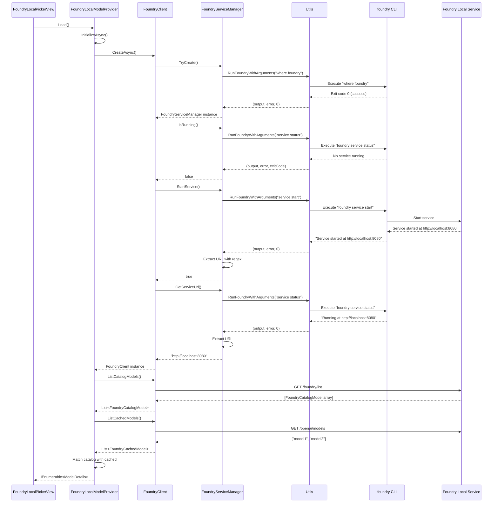
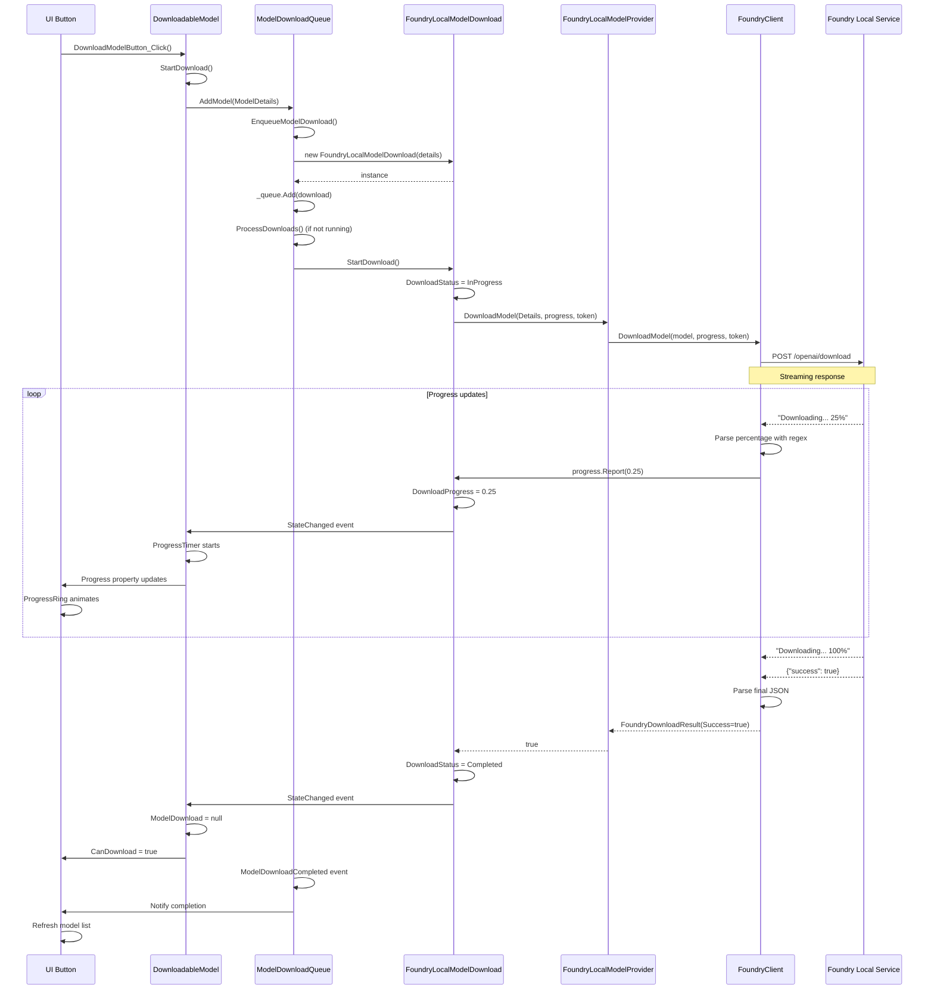
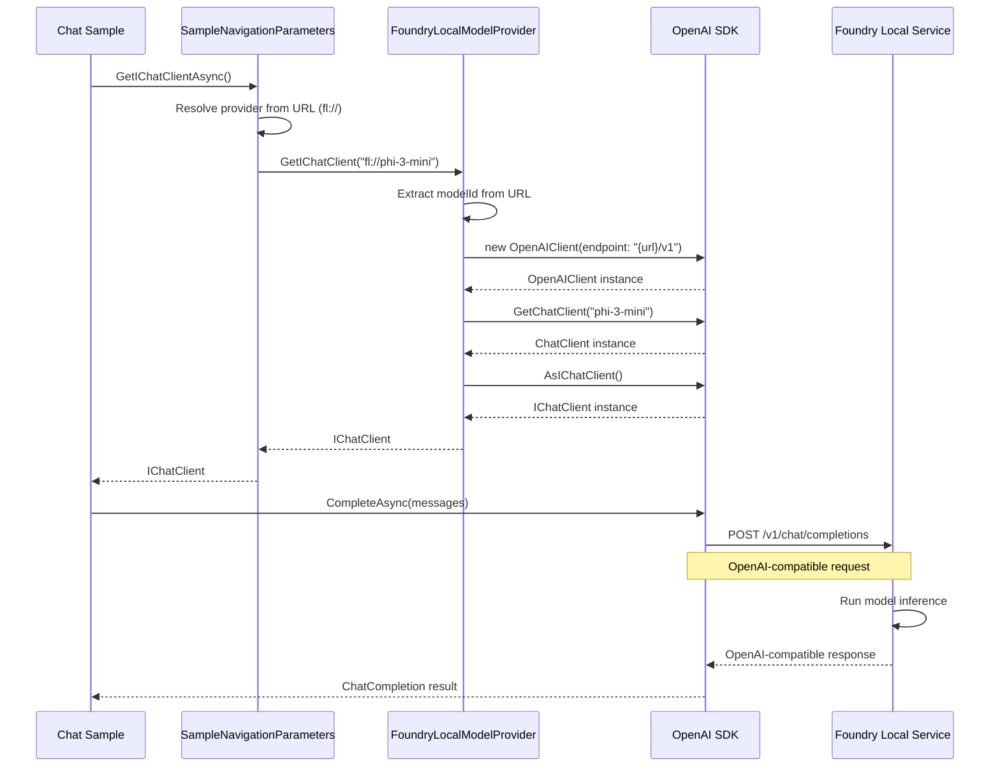

# Foundry Local Integration Architecture - Complete Technical Report

## Executive Summary

The Foundry Local integration in AI Dev Gallery enables users to discover, download, and run AI models through the Foundry Local service running on their local machine. This document provides a complete technical analysis of how this integration is built, from the UI layer down to the system-level interactions with the `foundry` CLI tool.

---

## Table of Contents

1. [Architecture Overview](#architecture-overview)
2. [Component Layers](#component-layers)
3. [Data Models](#data-models)
4. [Service Layer](#service-layer)
5. [Provider Layer](#provider-layer)
6. [UI Layer](#ui-layer)
7. [Download Flow](#download-flow)
8. [Integration with IChatClient](#integration-with-ichatclient)
9. [Sequence Diagrams](#sequence-diagrams)
10. [Key Design Patterns](#key-design-patterns)

---

## Architecture Overview

### High-Level Component Stack

```
???????????????????????????????????????????????????????????????
?                        UI Layer                              ?
?  FoundryLocalPickerView.xaml / .xaml.cs                     ?
?  - Model selection UI                                        ?
?  - Download UI with progress tracking                        ?
?  - Visual states (Loading/Available/NotAvailable)           ?
???????????????????????????????????????????????????????????????
                            ?
???????????????????????????????????????????????????????????????
?                    ViewModel Layer                           ?
?  DownloadableModel                                           ?
?  - Observable properties for UI binding                      ?
?  - Download state management                                 ?
???????????????????????????????????????????????????????????????
                            ?
???????????????????????????????????????????????????????????????
?                    Provider Layer                            ?
?  FoundryLocalModelProvider (Singleton)                       ?
?  - Implements IExternalModelProvider                         ?
?  - Model catalog management                                  ?
?  - IChatClient factory                                       ?
???????????????????????????????????????????????????????????????
                            ?
???????????????????????????????????????????????????????????????
?                    Client Layer                              ?
?  FoundryClient                                               ?
?  - HTTP API communication                                    ?
?  - Model listing and downloading                             ?
?  - Progress reporting                                        ?
???????????????????????????????????????????????????????????????
                            ?
???????????????????????????????????????????????????????????????
?                 Service Manager Layer                        ?
?  FoundryServiceManager                                       ?
?  - Service detection and lifecycle                           ?
?  - URL extraction and validation                             ?
???????????????????????????????????????????????????????????????
                            ?
???????????????????????????????????????????????????????????????
?                    System Layer                              ?
?  Utils.RunFoundryWithArguments                              ?
?  - Process execution wrapper                                 ?
?  - CLI command invocation                                    ?
???????????????????????????????????????????????????????????????
                            ?
???????????????????????????????????????????????????????????????
?              Foundry Local Service (External)                ?
?  foundry CLI                                                 ?
?  - service start/status                                      ?
?  - HTTP server on localhost                                  ?
?  - Model management                                          ?
???????????????????????????????????????????????????????????????
```

---

## Component Layers

### 1. System Layer - Process Execution

**File**: `AIDevGallery\ExternalModelUtils\FoundryLocal\Utils.cs`

#### Purpose
Low-level wrapper for executing the `foundry` CLI tool.

#### Implementation

```csharp
internal class Utils
{
    public async static Task<(string? Output, string? Error, int ExitCode)> 
        RunFoundryWithArguments(string arguments)
    {
        try
        {
            using (var p = new Process())
            {
                p.StartInfo.FileName = "foundry";
                p.StartInfo.Arguments = arguments;
                p.StartInfo.RedirectStandardOutput = true;
                p.StartInfo.RedirectStandardError = true;
                p.StartInfo.UseShellExecute = false;
                p.StartInfo.CreateNoWindow = true;

                p.Start();

                string output = await p.StandardOutput.ReadToEndAsync();
                string error = await p.StandardError.ReadToEndAsync();

                await p.WaitForExitAsync();

                return (output, error, p.ExitCode);
            }
        }
        catch
        {
            return (null, null, -1);
        }
    }
}
```

#### Key Features
- **Async Process Execution**: Uses `ReadToEndAsync` and `WaitForExitAsync`
- **Output Capture**: Redirects stdout and stderr
- **Silent Execution**: `CreateNoWindow = true` for background execution
- **Error Handling**: Returns exit code -1 on exception

---

### 2. Service Manager Layer - Service Lifecycle

**File**: `AIDevGallery\ExternalModelUtils\FoundryLocal\FoundryServiceManager.cs`

#### Purpose
Manages the Foundry Local service lifecycle and discovery.

#### Implementation

```csharp
internal class FoundryServiceManager()
{
    // Factory method with availability check
    public static FoundryServiceManager? TryCreate()
    {
        if (IsAvailable())
        {
            return new FoundryServiceManager();
        }
        return null;
    }

    // Check if foundry CLI is in PATH
    private static bool IsAvailable()
    {
        using var p = new Process();
        p.StartInfo.FileName = "where";
        p.StartInfo.Arguments = "foundry";
        p.StartInfo.RedirectStandardOutput = true;
        p.StartInfo.RedirectStandardError = true;
        p.StartInfo.UseShellExecute = false;
        p.StartInfo.CreateNoWindow = true;
        p.Start();
        p.WaitForExit();
        return p.ExitCode == 0;
    }

    // Extract URL from foundry CLI output
    private string? GetUrl(string output)
    {
        var match = Regex.Match(output, @"https?:\/\/[^\/]+:\d+");
        if (match.Success)
        {
            return match.Value;
        }
        return null;
    }

    // Get the service URL if running
    public async Task<string?> GetServiceUrl()
    {
        var status = await Utils.RunFoundryWithArguments("service status");

        if (status.ExitCode != 0 || string.IsNullOrWhiteSpace(status.Output))
        {
            return null;
        }

        return GetUrl(status.Output);
    }

    // Check if service is running
    public async Task<bool> IsRunning()
    {
        var url = await GetServiceUrl();
        return url != null;
    }

    // Start the service if not running
    public async Task<bool> StartService()
    {
        if (await IsRunning())
        {
            return true;
        }

        var status = await Utils.RunFoundryWithArguments("service start");
        if (status.ExitCode != 0 || string.IsNullOrWhiteSpace(status.Output))
        {
            return false;
        }

        return GetUrl(status.Output) != null;
    }
}
```

#### Responsibilities
1. **Service Detection**: Uses `where foundry` to check if CLI is available
2. **Status Checking**: Runs `foundry service status` to check if running
3. **Auto-Start**: Automatically starts service with `foundry service start`
4. **URL Extraction**: Parses URL from CLI output using regex
5. **Lifecycle Management**: Ensures service is running before API calls

#### CLI Commands Used
- `where foundry` - Check if foundry is installed
- `foundry service status` - Get service status and URL
- `foundry service start` - Start the Foundry Local service

---

### 3. Client Layer - HTTP API Communication

**File**: `AIDevGallery\ExternalModelUtils\FoundryLocal\FoundryClient.cs`

#### Purpose
HTTP client for communicating with the Foundry Local REST API.

#### Implementation

##### Factory Method with Service Initialization

```csharp
public static async Task<FoundryClient?> CreateAsync()
{
    var serviceManager = FoundryServiceManager.TryCreate();
    if (serviceManager == null)
    {
        return null;  // foundry CLI not available
    }

    if (!await serviceManager.IsRunning())
    {
        if (!await serviceManager.StartService())
        {
            return null;  // Failed to start service
        }
    }

    var serviceUrl = await serviceManager.GetServiceUrl();

    if (string.IsNullOrEmpty(serviceUrl))
    {
        return null;  // No valid URL
    }

    return new FoundryClient(serviceUrl, serviceManager, new HttpClient());
}
```

##### List Catalog Models

**API Endpoint**: `GET {baseUrl}/foundry/list`

```csharp
public async Task<List<FoundryCatalogModel>> ListCatalogModels()
{
    if (_catalogModels.Count > 0)
    {
        return _catalogModels;  // Return cached
    }

    try
    {
        var response = await _httpClient.GetAsync($"{_baseUrl}/foundry/list");
        response.EnsureSuccessStatusCode();

        var models = await JsonSerializer.DeserializeAsync(
            response.Content.ReadAsStream(),
            FoundryJsonContext.Default.ListFoundryCatalogModel);

        if (models != null && models.Count > 0)
        {
            models.ForEach(_catalogModels.Add);
        }
    }
    catch
    {
        // Silently fail - return empty list
    }

    return _catalogModels;
}
```

##### List Cached (Downloaded) Models

**API Endpoint**: `GET {baseUrl}/openai/models`

```csharp
public async Task<List<FoundryCachedModel>> ListCachedModels()
{
    var response = await _httpClient.GetAsync($"{_baseUrl}/openai/models");
    response.EnsureSuccessStatusCode();

    var catalogModels = await ListCatalogModels();

    var content = await response.Content.ReadAsStringAsync();
    var modelIds = content.Trim('[', ']')
        .Split(',', StringSplitOptions.TrimEntries | StringSplitOptions.RemoveEmptyEntries)
        .Select(id => id.Trim('"'));

    List<FoundryCachedModel> models = [];

    foreach (var id in modelIds)
    {
        var model = catalogModels.FirstOrDefault(m => m.Name == id);
        if (model != null)
        {
            models.Add(new FoundryCachedModel(id, model.Alias));
        }
        else
        {
            models.Add(new FoundryCachedModel(id, null));
        }
    }

    return models;
}
```

##### Download Model with Progress Tracking

**API Endpoint**: `POST {baseUrl}/openai/download`

```csharp
public async Task<FoundryDownloadResult> DownloadModel(
    FoundryCatalogModel model, 
    IProgress<float>? progress, 
    CancellationToken cancellationToken = default)
{
    // Check if already downloaded
    var models = await ListCachedModels();
    if (models.Any(m => m.Name == model.Name))
    {
        return new(true, "Model already downloaded");
    }

    return await Task.Run(async () =>
    {
        try
        {
            // Build request body
            var uploadBody = new FoundryDownloadBody(
                new FoundryModelDownload(
                    Name: model.Name,
                    Uri: model.Uri,
                    Path: await GetModelPath(model.Uri),  // Get blob path
                    ProviderType: model.ProviderType,
                    PromptTemplate: model.PromptTemplate),
                IgnorePipeReport: true);

            string body = JsonSerializer.Serialize(
                 uploadBody,
                 FoundryJsonContext.Default.FoundryDownloadBody);

            using var request = new HttpRequestMessage(
                HttpMethod.Post, 
                $"{_baseUrl}/openai/download")
            {
                Content = new StringContent(body, Encoding.UTF8, "application/json")
            };

            // Send with streaming response
            using var response = await _httpClient.SendAsync(
                request, 
                HttpCompletionOption.ResponseHeadersRead, 
                cancellationToken);

            response.EnsureSuccessStatusCode();

            // Parse streaming response
            using var stream = await response.Content.ReadAsStreamAsync(cancellationToken);
            using var reader = new StreamReader(stream);

            string? finalJson = null;
            var line = await reader.ReadLineAsync(cancellationToken);

            while (!reader.EndOfStream && !cancellationToken.IsCancellationRequested)
            {
                cancellationToken.ThrowIfCancellationRequested();
                line = await reader.ReadLineAsync(cancellationToken);
                if (line is null)
                {
                    continue;
                }

                line = line.Trim();

                // Final response starts with '{'
                if (finalJson != null || line.StartsWith('{'))
                {
                    finalJson += line;
                    continue;
                }

                // Parse progress percentage
                var match = Regex.Match(line, @"\d+(\.\d+)?%");
                if (match.Success)
                {
                    var percentage = match.Value;
                    if (float.TryParse(percentage.TrimEnd('%'), out float progressValue))
                    {
                        progress?.Report(progressValue / 100);
                    }
                }
            }

            // Parse final result
            var result = finalJson is not null
                   ? JsonSerializer.Deserialize(
                       finalJson, 
                       FoundryJsonContext.Default.FoundryDownloadResult)!
                   : new FoundryDownloadResult(false, "Missing final result from server.");

            return result;
        }
        catch (Exception e)
        {
            return new FoundryDownloadResult(false, e.Message);
        }
    });
}
```

#### Key Features
1. **Lazy Initialization**: Only creates client when service is confirmed available
2. **Automatic Service Start**: Starts service if not running
3. **Caching**: Caches catalog models to reduce API calls
4. **Streaming Downloads**: Uses `HttpCompletionOption.ResponseHeadersRead` for progress tracking
5. **Progress Reporting**: Parses percentage from streaming text output
6. **Cancellation Support**: Honors `CancellationToken` for download cancellation

#### API Endpoints

| Endpoint | Method | Purpose | Response Format |
|----------|--------|---------|-----------------|
| `/foundry/list` | GET | List all available models in catalog | JSON array of `FoundryCatalogModel` |
| `/openai/models` | GET | List downloaded models | JSON array of model IDs |
| `/openai/download` | POST | Download a model | Streaming text with final JSON |
| `/v1/*` | * | OpenAI-compatible inference API | OpenAI format |

---

### 4. Provider Layer - Model Management

**File**: `AIDevGallery\ExternalModelUtils\FoundryLocalModelProvider.cs`

#### Purpose
Singleton provider implementing `IExternalModelProvider` interface for the Foundry Local integration.

#### Implementation

##### Singleton Pattern

```csharp
internal class FoundryLocalModelProvider : IExternalModelProvider
{
    public static FoundryLocalModelProvider Instance { get; } = new FoundryLocalModelProvider();
    
    private IEnumerable<ModelDetails>? _downloadedModels;
    private IEnumerable<ModelDetails>? _catalogModels;
    private FoundryClient? _foundryManager;
    private string? url;
    
    // ... implementation
}
```

##### Provider Metadata

```csharp
public string Name => "FoundryLocal";
public HardwareAccelerator ModelHardwareAccelerator => HardwareAccelerator.FOUNDRYLOCAL;
public List<string> NugetPackageReferences => ["Microsoft.Extensions.AI.OpenAI"];
public string ProviderDescription => "The model will run locally via Foundry Local";
public string UrlPrefix => "fl://";
public string Icon => $"fl{AppUtils.GetThemeAssetSuffix()}.svg";
public string Url => url ?? string.Empty;
public string? IChatClientImplementationNamespace { get; } = "OpenAI";
```

##### Initialization Logic

```csharp
private async Task InitializeAsync(CancellationToken cancelationToken = default)
{
    // Return early if already initialized
    if (_foundryManager != null && _downloadedModels != null && _downloadedModels.Any())
    {
        return;
    }

    // Create FoundryClient (starts service if needed)
    _foundryManager = _foundryManager ?? await FoundryClient.CreateAsync();

    if (_foundryManager == null)
    {
        return;  // Service not available
    }

    // Get service URL
    url = url ?? await _foundryManager.ServiceManager.GetServiceUrl();

    // Load catalog models (all available for download)
    if (_catalogModels == null || !_catalogModels.Any())
    {
        _catalogModels = (await _foundryManager.ListCatalogModels())
            .Select(m => ToModelDetails(m));
    }

    // Get already downloaded models
    var cachedModels = await _foundryManager.ListCachedModels();

    List<ModelDetails> downloadedModels = [];

    // Match catalog models with cached models
    foreach (var model in _catalogModels)
    {
        var cachedModel = cachedModels.FirstOrDefault(m => m.Name == model.Name);

        if (cachedModel != default)
        {
            model.Id = $"{UrlPrefix}{cachedModel.Id}";
            downloadedModels.Add(model);
            cachedModels.Remove(cachedModel);
        }
    }

    // Add any cached models not in catalog (user-added models)
    foreach (var model in cachedModels)
    {
        downloadedModels.Add(new ModelDetails()
        {
            Id = $"fl-{model.Name}",
            Name = model.Name,
            Url = $"{UrlPrefix}{model.Name}",
            Description = $"{model.Name} running locally with Foundry Local",
            HardwareAccelerators = [HardwareAccelerator.FOUNDRYLOCAL],
            SupportedOnQualcomm = true,
            ProviderModelDetails = model
        });
    }

    _downloadedModels = downloadedModels;
}
```

##### Get Downloaded Models

```csharp
public async Task<IEnumerable<ModelDetails>> GetModelsAsync(
    bool ignoreCached = false, 
    CancellationToken cancelationToken = default)
{
    if (ignoreCached)
    {
        Reset();  // Clear cache and reinitialize
    }

    await InitializeAsync(cancelationToken);

    return _downloadedModels ?? [];
}
```

##### Get All Catalog Models

```csharp
public IEnumerable<ModelDetails> GetAllModelsInCatalog()
{
    return _catalogModels ?? [];
}
```

##### Download Model

```csharp
public async Task<bool> DownloadModel(
    ModelDetails modelDetails, 
    IProgress<float>? progress, 
    CancellationToken cancellationToken = default)
{
    if (_foundryManager == null)
    {
        return false;
    }

    if (modelDetails.ProviderModelDetails is not FoundryCatalogModel model)
    {
        return false;
    }

    return (await _foundryManager.DownloadModel(model, progress, cancellationToken)).Success;
}
```

##### IChatClient Factory

```csharp
public IChatClient? GetIChatClient(string url)
{
    var modelId = url.Split('/').LastOrDefault();
    return new OpenAIClient(
        new ApiKeyCredential("none"), 
        new OpenAIClientOptions
        {
            Endpoint = new Uri($"{Url}/v1")
        })
        .GetChatClient(modelId)
        .AsIChatClient();
}

public string? GetIChatClientString(string url)
{
    var modelId = url.Split('/').LastOrDefault();
    return $"new OpenAIClient(new ApiKeyCredential(\"none\"), " +
           $"new OpenAIClientOptions{{ Endpoint = new Uri(\"{Url}/v1\") }})" +
           $".GetChatClient(\"{modelId}\").AsIChatClient()";
}
```

##### Availability Check

```csharp
public async Task<bool> IsAvailable()
{
    await InitializeAsync();
    return _foundryManager != null;
}
```

#### Key Responsibilities
1. **Service Discovery**: Automatically detects and starts Foundry Local service
2. **Model Catalog Management**: Maintains lists of available and downloaded models
3. **URL Scheme**: Uses `fl://` prefix for Foundry Local model URLs
4. **IChatClient Integration**: Provides OpenAI-compatible chat client
5. **Download Orchestration**: Delegates downloads to FoundryClient
6. **Caching**: Caches model lists to minimize API calls

---

### 5. ViewModel Layer - Download State Management

**File**: `AIDevGallery\ViewModels\DownloadableModel.cs`

#### Purpose
Observable model for UI binding with download progress tracking.

#### Implementation

```csharp
internal partial class DownloadableModel : BaseModel
{
    private readonly DispatcherTimer _progressTimer;

    [ObservableProperty]
    public partial float Progress { get; set; }

    [ObservableProperty]
    public partial bool CanDownload { get; set; }

    [ObservableProperty]
    public partial DownloadStatus Status { get; set; } = DownloadStatus.Waiting;

    private ModelDownload? _modelDownload;

    public ModelDownload? ModelDownload
    {
        get => _modelDownload;
        set
        {
            if (value != null && value == _modelDownload)
            {
                return;
            }

            if (_modelDownload != null)
            {
                _modelDownload.StateChanged -= ModelDownload_StateChanged;
            }

            _modelDownload = value;

            if (_modelDownload == null)
            {
                CanDownload = true;
                return;
            }

            _modelDownload.StateChanged += ModelDownload_StateChanged;
            Status = _modelDownload.DownloadStatus;
            Progress = _modelDownload.DownloadProgress;
            CanDownload = false;
        }
    }

    public void StartDownload()
    {
        ModelDownload ??= App.ModelDownloadQueue.AddModel(ModelDetails);
    }

    private void ModelDownload_StateChanged(object? sender, ModelDownloadEventArgs e)
    {
        if (!_progressTimer.IsEnabled)
        {
            _progressTimer.Start();
        }

        if (e.Status == DownloadStatus.Completed)
        {
            Status = DownloadStatus.Completed;
            ModelDownload = null;
        }

        if (e.Status == DownloadStatus.Canceled)
        {
            Status = DownloadStatus.Canceled;
            ModelDownload = null;
            Progress = 0;
        }
    }

    private void ProgressTimer_Tick(object? sender, object e)
    {
        _progressTimer.Stop();
        if (ModelDownload != null)
        {
            Progress = ModelDownload.DownloadProgress * 100;
            Status = ModelDownload.DownloadStatus;
        }
    }
}
```

#### Key Features
1. **Observable Properties**: Uses CommunityToolkit.Mvvm for INPC
2. **Progress Throttling**: Uses DispatcherTimer to throttle UI updates (300ms)
3. **Event Subscription**: Listens to download state changes
4. **Auto-Cleanup**: Removes download reference when complete/canceled

---

### 6. Download Queue - Centralized Download Management

**File**: `AIDevGallery\Utils\ModelDownloadQueue.cs`

#### Purpose
Centralized queue for managing all model downloads in the application.

#### Implementation

```csharp
internal class ModelDownloadQueue()
{
    private readonly List<ModelDownload> _queue = [];
    public event EventHandler<ModelDownloadCompletedEventArgs>? ModelDownloadCompleted;
    public event ModelsChangedHandler? ModelsChanged;

    private Task? processingTask;

    public ModelDownload? AddModel(ModelDetails modelDetails)
    {
        if (App.ModelCache.IsModelCached(modelDetails.Url))
        {
            return null;  // Already downloaded
        }

        var existingDownload = GetDownload(modelDetails.Url);
        if (existingDownload != null)
        {
            return existingDownload;  // Already in queue
        }

        var download = EnqueueModelDownload(modelDetails);
        return download;
    }

    private ModelDownload EnqueueModelDownload(ModelDetails modelDetails)
    {
        ModelDownload modelDownload;

        // Create appropriate download type
        if (modelDetails.Url.StartsWith("fl:", StringComparison.InvariantCultureIgnoreCase))
        {
            modelDownload = new FoundryLocalModelDownload(modelDetails);
        }
        else
        {
            modelDownload = new OnnxModelDownload(modelDetails);
        }

        _queue.Add(modelDownload);
        ModelDownloadEnqueueEvent.Log(modelDetails.Url);
        ModelsChanged?.Invoke(this);

        // Start processing if not already running
        lock (this)
        {
            if (processingTask == null || processingTask.IsFaulted)
            {
                processingTask = Task.Run(ProcessDownloads);
            }
        }

        return modelDownload;
    }

    private async Task ProcessDownloads()
    {
        while (_queue.Count > 0)
        {
            var download = _queue[0];
            TaskCompletionSource<bool> tcs = new();
            
            App.MainWindow.DispatcherQueue.TryEnqueue(async () =>
            {
                try
                {
                    await Download(download);
                    _queue.Remove(download);
                    ModelsChanged?.Invoke(this);
                    download.Dispose();
                    tcs.SetResult(true);
                }
                catch (TaskCanceledException)
                {
                }
                catch (Exception e)
                {
                    tcs.SetException(e);
                }
            });

            await tcs.Task;
        }

        processingTask = null;
    }

    private async Task Download(ModelDownload modelDownload)
    {
        ModelDownloadStartEvent.Log(modelDownload.Details.Url);

        bool success = await modelDownload.StartDownload();

        if (success)
        {
            ModelDownloadCompleteEvent.Log(modelDownload.Details.Url);
            ModelDownloadCompleted?.Invoke(this, new ModelDownloadCompletedEventArgs());
            SendNotification(modelDownload.Details);
        }
    }
}
```

#### Key Features
1. **Sequential Processing**: Processes downloads one at a time
2. **Deduplication**: Prevents duplicate downloads
3. **Event Notifications**: Fires events when downloads complete
4. **UI Thread Marshaling**: Ensures downloads run on UI thread
5. **Telemetry**: Logs download events

---

### 7. Download Implementation - Foundry Local Specific

**File**: `AIDevGallery\Utils\ModelDownload.cs`

#### Purpose
Foundry Local-specific download implementation.

#### Implementation

```csharp
internal class FoundryLocalModelDownload : ModelDownload
{
    public FoundryLocalModelDownload(ModelDetails details)
        : base(details)
    {
    }

    public override void CancelDownload()
    {
        CancellationTokenSource.Cancel();
        DownloadStatus = DownloadStatus.Canceled;
    }

    public override async Task<bool> StartDownload()
    {
        DownloadStatus = DownloadStatus.InProgress;

        Progress<float> internalProgress = new(p =>
        {
            DownloadProgress = p;
        });

        bool result = false;

        try
        {
            result = await FoundryLocalModelProvider.Instance.DownloadModel(
                Details, 
                internalProgress, 
                CancellationTokenSource.Token);
        }
        catch
        {
            // Silently handle errors
        }

        if (result)
        {
            DownloadStatus = DownloadStatus.Completed;
            return true;
        }
        else
        {
            DownloadStatus = DownloadStatus.Canceled;
            return false;
        }
    }
}
```

#### Key Features
1. **Delegates to Provider**: Uses `FoundryLocalModelProvider.Instance.DownloadModel`
2. **Progress Reporting**: Updates `DownloadProgress` property
3. **Status Management**: Transitions through download states
4. **Cancellation Support**: Uses `CancellationTokenSource`

---

### 8. UI Layer - Model Picker View

**File**: `AIDevGallery\Controls\ModelPicker\ModelPickerViews\FoundryLocalPickerView.xaml.cs`

#### Purpose
WinUI 3 control for displaying and managing Foundry Local models.

#### Data Structures

```csharp
internal record FoundryCatalogModelGroup(
    string Alias, 
    string License, 
    IEnumerable<FoundryCatalogModelDetails> Details, 
    IEnumerable<DownloadableModel> Models);

internal record FoundryCatalogModelDetails(
    Runtime Runtime, 
    long SizeInBytes);

internal record FoundryModelPair(
    string Name, 
    ModelDetails ModelDetails, 
    FoundryCatalogModel? FoundryCatalogModel);
```

#### Implementation

##### Initialization

```csharp
internal sealed partial class FoundryLocalPickerView : BaseModelPickerView
{
    private ObservableCollection<FoundryModelPair> AvailableModels { get; } = [];
    private ObservableCollection<FoundryCatalogModelGroup> CatalogModels { get; } = [];
    private string FoundryLocalUrl => FoundryLocalModelProvider.Instance?.Url ?? string.Empty;

    public FoundryLocalPickerView()
    {
        this.InitializeComponent();

        App.ModelDownloadQueue.ModelDownloadCompleted += 
            ModelDownloadQueue_ModelDownloadCompleted;
    }

    private void ModelDownloadQueue_ModelDownloadCompleted(
        object? sender, 
        Utils.ModelDownloadCompletedEventArgs e)
    {
        _ = Load([]);  // Reload models after download
    }
}
```

##### Load Models

```csharp
public override async Task Load(List<ModelType> types)
{
    VisualStateManager.GoToState(this, "ShowLoading", true);

    // Check if Foundry Local is available
    if (!await FoundryLocalModelProvider.Instance.IsAvailable())
    {
        VisualStateManager.GoToState(this, "ShowNotAvailable", true);
        return;
    }

    AvailableModels.Clear();
    CatalogModels.Clear();

    // Load downloaded models
    foreach (var model in await FoundryLocalModelProvider.Instance.GetModelsAsync(
        ignoreCached: true) ?? [])
    {
        if (model.ProviderModelDetails is FoundryCatalogModel foundryModel)
        {
            AvailableModels.Add(new(foundryModel.Alias, model, foundryModel));
        }
        else
        {
            AvailableModels.Add(new(model.Name, model, null));
        }
    }

    // Build catalog model groups
    var catalogModelsDict = FoundryLocalModelProvider.Instance
        .GetAllModelsInCatalog()
        .ToDictionary(m => m.Name, m => m);

    var catalogModels = catalogModelsDict.Values
        .Select(m => (m.ProviderModelDetails as FoundryCatalogModel)!)
        .GroupBy(f => f!.Alias)  // Group by model alias
        .OrderByDescending(f => f.Key);

    foreach (var m in catalogModels)
    {
        // Get first model not already downloaded
        var firstModel = m.FirstOrDefault(
            m => !AvailableModels.Any(cm => cm.ModelDetails.Name == m.Name));
        
        if (firstModel == null)
        {
            continue;  // All variants downloaded
        }

        CatalogModels.Add(new FoundryCatalogModelGroup(
            m.Key,  // Alias
            firstModel!.License.ToLowerInvariant(),
            m.Select(m => new FoundryCatalogModelDetails(
                m.Runtime, 
                m.FileSizeMb * 1024 * 1024)),
            m.Where(m => !AvailableModels.Any(cm => cm.ModelDetails.Name == m.Name))
             .Select(m => new DownloadableModel(catalogModelsDict[m.Name]))));
    }

    VisualStateManager.GoToState(this, "ShowModels", true);
}
```

##### Download Button Handler

```csharp
private void DownloadModelButton_Click(object sender, RoutedEventArgs e)
{
    if (sender is Button button && button.Tag is DownloadableModel downloadableModel)
    {
        downloadableModel.StartDownload();
    }
}
```

##### Model Selection

```csharp
private void ModelSelectionItemsView_SelectionChanged(
    ItemsView sender, 
    ItemsViewSelectionChangedEventArgs args)
{
    if (sender.SelectedItem is FoundryModelPair pair && 
        pair.FoundryCatalogModel is not null)
    {
        OnSelectedModelChanged(this, pair.ModelDetails);
    }
}
```

#### UI Features
1. **Visual States**: Loading, ShowModels, ShowNotAvailable
2. **Grouped Display**: Groups models by alias with multiple runtime variants
3. **Download Progress**: Shows progress for each download
4. **Selection Tracking**: Notifies parent when model is selected
5. **Auto-Refresh**: Reloads after download completion

---

### 9. XAML UI Definition

**File**: `AIDevGallery\Controls\ModelPicker\ModelPickerViews\FoundryLocalPickerView.xaml`

#### Key UI Elements

##### Visual States

```xml
<VisualStateManager.VisualStateGroups>
    <VisualStateGroup x:Name="StateGroup">
        <VisualState x:Name="ShowLoading" />
        <VisualState x:Name="ShowModels">
            <VisualState.Setters>
                <Setter Target="LoadingIndicator.Visibility" Value="Collapsed" />
                <Setter Target="NotAvailableGrid.Visibility" Value="Collapsed" />
                <Setter Target="ModelsView.Visibility" Value="Visible" />
            </VisualState.Setters>
        </VisualState>
        <VisualState x:Name="ShowNotAvailable">
            <VisualState.Setters>
                <Setter Target="LoadingIndicator.Visibility" Value="Collapsed" />
                <Setter Target="NotAvailableGrid.Visibility" Value="Visible" />
                <Setter Target="ModelsView.Visibility" Value="Collapsed" />
            </VisualState.Setters>
        </VisualState>
    </VisualStateGroup>
</VisualStateManager.VisualStateGroups>
```

##### Downloaded Models List

```xml
<ItemsView
    x:Name="ModelSelectionItemsView"
    ItemsSource="{x:Bind AvailableModels, Mode=OneWay}"
    SelectionChanged="ModelSelectionItemsView_SelectionChanged"
    SelectionMode="Single">
    <ItemsView.ItemTemplate>
        <DataTemplate x:DataType="local:FoundryModelPair">
            <ItemContainer CornerRadius="{StaticResource ControlCornerRadius}" Tag="{x:Bind}">
                <toolkit:SettingsCard
                    MinHeight="48"
                    Background="{ThemeResource LayerFillColorAltBrush}">
                    <toolkit:SettingsCard.Header>
                        <TextBlock Text="{x:Bind Name}" />
                    </toolkit:SettingsCard.Header>
                    <toolkit:SettingsCard.Description>
                        <TextBlock Text="{x:Bind utils:AppUtils.FileSizeToString(ModelDetails.Size)}" />
                    </toolkit:SettingsCard.Description>
                </toolkit:SettingsCard>
            </ItemContainer>
        </DataTemplate>
    </ItemsView.ItemTemplate>
</ItemsView>
```

##### Catalog Models (Available for Download)

```xml
<ItemsRepeater
    Grid.Row="2"
    ItemsSource="{x:Bind CatalogModels, Mode=OneWay}">
    <ItemsRepeater.ItemTemplate>
        <DataTemplate x:DataType="local:FoundryCatalogModelGroup">
            <toolkit:SettingsCard Tag="{x:Bind}">
                <toolkit:SettingsCard.Header>
                    <TextBlock Text="{x:Bind Alias}" />
                </toolkit:SettingsCard.Header>
                <DropDownButton
                    Content="{ui:FontIcon Glyph=&#xE896;}"
                    Tag="{x:Bind}">
                    <DropDownButton.Flyout>
                        <Flyout>
                            <ItemsRepeater ItemsSource="{x:Bind Models}">
                                <ItemsRepeater.ItemTemplate>
                                    <DataTemplate x:DataType="vm:DownloadableModel">
                                        <Button
                                            Click="DownloadModelButton_Click"
                                            IsEnabled="{x:Bind CanDownload}"
                                            Tag="{x:Bind}">
                                            <ProgressRing
                                                IsIndeterminate="False"
                                                Value="{x:Bind Progress, Mode=OneWay}" />
                                        </Button>
                                    </DataTemplate>
                                </ItemsRepeater.ItemTemplate>
                            </ItemsRepeater>
                        </Flyout>
                    </DropDownButton.Flyout>
                </DropDownButton>
            </toolkit:SettingsCard>
        </DataTemplate>
    </ItemsRepeater.ItemTemplate>
</ItemsRepeater>
```

##### Not Available State

```xml
<Grid x:Name="NotAvailableGrid" Visibility="Collapsed">
    <StackPanel>
        <Image Width="36" Source="ms-appx:///Assets/ModelIcons/fl.light.svg" />
        <TextBlock Text="Foundry Local is not installed on this machine" />
        <TextBlock>
            <Hyperlink NavigateUri="https://aka.ms/fl-install-from-gallery">
                Install Foundry Local
            </Hyperlink>
        </TextBlock>
    </StackPanel>
</Grid>
```

---

## Data Models

### FoundryCatalogModel

**File**: `AIDevGallery\ExternalModelUtils\FoundryLocal\FoundryCatalogModel.cs`

Complete model representing a model in the Foundry Local catalog:

```csharp
internal record FoundryCatalogModel
{
    [JsonPropertyName("name")]
    public string Name { get; init; } = default!;

    [JsonPropertyName("displayName")]
    public string DisplayName { get; init; } = default!;

    [JsonPropertyName("providerType")]
    public string ProviderType { get; init; } = default!;

    [JsonPropertyName("uri")]
    public string Uri { get; init; } = default!;

    [JsonPropertyName("version")]
    public string Version { get; init; } = default!;

    [JsonPropertyName("modelType")]
    public string ModelType { get; init; } = default!;

    [JsonPropertyName("promptTemplate")]
    public PromptTemplate PromptTemplate { get; init; } = default!;

    [JsonPropertyName("publisher")]
    public string Publisher { get; init; } = default!;

    [JsonPropertyName("task")]
    public string Task { get; init; } = default!;

    [JsonPropertyName("runtime")]
    public Runtime Runtime { get; init; } = default!;

    [JsonPropertyName("fileSizeMb")]
    public long FileSizeMb { get; init; }

    [JsonPropertyName("modelSettings")]
    public ModelSettings ModelSettings { get; init; } = default!;

    [JsonPropertyName("alias")]
    public string Alias { get; init; } = default!;

    [JsonPropertyName("supportsToolCalling")]
    public bool SupportsToolCalling { get; init; }

    [JsonPropertyName("license")]
    public string License { get; init; } = default!;

    [JsonPropertyName("licenseDescription")]
    public string LicenseDescription { get; init; } = default!;

    [JsonPropertyName("parentModelUri")]
    public string ParentModelUri { get; init; } = default!;
}
```

### Supporting Records

```csharp
internal record PromptTemplate
{
    [JsonPropertyName("assistant")]
    public string Assistant { get; init; } = default!;

    [JsonPropertyName("prompt")]
    public string Prompt { get; init; } = default!;
}

internal record Runtime
{
    [JsonPropertyName("deviceType")]
    public string DeviceType { get; init; } = default!;

    [JsonPropertyName("executionProvider")]
    public string ExecutionProvider { get; init; } = default!;
}

internal record FoundryCachedModel(string Name, string? Id);

internal record FoundryDownloadResult(bool Success, string? ErrorMessage);

internal record FoundryModelDownload(
    string Name,
    string Uri,
    string Path,
    string ProviderType,
    PromptTemplate PromptTemplate);

internal record FoundryDownloadBody(
    FoundryModelDownload Model, 
    bool IgnorePipeReport);
```

### JSON Source Generation

**File**: `AIDevGallery\ExternalModelUtils\FoundryLocal\FoundryJsonContext.cs`

Uses System.Text.Json source generators for AOT compilation:

```csharp
[JsonSourceGenerationOptions(
    PropertyNamingPolicy = JsonKnownNamingPolicy.CamelCase,
    WriteIndented = false)]
[JsonSerializable(typeof(FoundryCatalogModel))]
[JsonSerializable(typeof(List<FoundryCatalogModel>))]
[JsonSerializable(typeof(FoundryDownloadResult))]
[JsonSerializable(typeof(FoundryDownloadBody))]
internal partial class FoundryJsonContext : JsonSerializerContext
{
}
```

---

## Integration with IChatClient

### OpenAI-Compatible API

Foundry Local exposes an OpenAI-compatible API at `/v1/*` endpoints.

### IChatClient Creation

```csharp
public IChatClient? GetIChatClient(string url)
{
    var modelId = url.Split('/').LastOrDefault();
    return new OpenAIClient(
        new ApiKeyCredential("none"),  // No API key needed
        new OpenAIClientOptions
        {
            Endpoint = new Uri($"{Url}/v1")  // Foundry Local endpoint
        })
        .GetChatClient(modelId)
        .AsIChatClient();
}
```

### Usage in Samples

When a sample uses a Foundry Local model:

1. **Model Selection**: User selects a model with `fl://` URL
2. **IChatClient Request**: Sample requests `IChatClient` via `SampleNavigationParameters`
3. **Provider Resolution**: System identifies `FoundryLocalModelProvider` from URL prefix
4. **Client Creation**: Provider creates OpenAI client pointing to `{foundryUrl}/v1`
5. **Inference**: Sample uses standard `IChatClient` API
6. **Request Flow**: 
   - Sample ? `IChatClient.CompleteAsync()`
   - OpenAI SDK ? HTTP POST to `{foundryUrl}/v1/chat/completions`
   - Foundry Local ? Model inference
   - Response ? OpenAI SDK ? `IChatClient` ? Sample

### Code Generation String

For sample export/documentation:

```csharp
public string? GetIChatClientString(string url)
{
    var modelId = url.Split('/').LastOrDefault();
    return $"new OpenAIClient(new ApiKeyCredential(\"none\"), " +
           $"new OpenAIClientOptions{{ Endpoint = new Uri(\"{Url}/v1\") }})" +
           $".GetChatClient(\"{modelId}\").AsIChatClient()";
}
```

---

## Download Flow - Complete Sequence

### User Initiates Download

```
User clicks download button
    ?
DownloadModelButton_Click()
    ?
downloadableModel.StartDownload()
    ?
ModelDownloadQueue.AddModel(ModelDetails)
    ?
if (url.StartsWith("fl:"))
    new FoundryLocalModelDownload(modelDetails)
else
    new OnnxModelDownload(modelDetails)
    ?
_queue.Add(modelDownload)
    ?
ProcessDownloads() starts if not running
```

### Download Processing

```
ProcessDownloads()
    ?
While queue has items:
    Get first download
        ?
    Marshal to UI thread
        ?
    download.StartDownload()
        ?
    FoundryLocalModelDownload.StartDownload()
        ?
    FoundryLocalModelProvider.Instance.DownloadModel()
        ?
    FoundryClient.DownloadModel()
        ?
    POST {baseUrl}/openai/download
        ?
    Stream response, parse progress
        ?
    Report progress via IProgress<float>
        ?
    ModelDownload.DownloadProgress updates
        ?
    StateChanged event fires
        ?
    DownloadableModel.ModelDownload_StateChanged()
        ?
    DispatcherTimer throttles UI updates
        ?
    ProgressTimer_Tick() updates Progress property
        ?
    UI bindings update ProgressRing
        ?
    Download completes
        ?
    ModelDownloadCompleted event fires
        ?
    FoundryLocalPickerView.ModelDownloadQueue_ModelDownloadCompleted()
        ?
    Load([]) refreshes model list
```

### Progress Reporting Chain

```
Foundry Local Service (streaming text with %)
    ?
FoundryClient.DownloadModel() 
    parses % with regex
    ?
IProgress<float>.Report(value)
    ?
FoundryLocalModelDownload.DownloadProgress property
    ?
StateChanged event
    ?
DownloadableModel.ModelDownload_StateChanged()
    ?
DispatcherTimer (300ms throttle)
    ?
ProgressTimer_Tick()
    ?
Progress property (observable)
    ?
UI binding updates
    ?
ProgressRing.Value animates
```

---

## Sequence Diagrams

### Service Initialization Sequence



### Model Download Sequence



### IChatClient Usage Sequence



---

## Key Design Patterns

### 1. Singleton Pattern
**Where**: `FoundryLocalModelProvider.Instance`
**Why**: Single shared instance for service communication and caching

### 2. Factory Pattern
**Where**: `FoundryClient.CreateAsync()`
**Why**: Complex initialization with service lifecycle management

### 3. Provider Pattern
**Where**: `IExternalModelProvider` interface
**Why**: Pluggable model providers (Foundry Local, Ollama, OpenAI, etc.)

### 4. Observer Pattern
**Where**: `ModelDownload.StateChanged` event
**Why**: UI components observe download progress

### 5. Repository Pattern
**Where**: `FoundryLocalModelProvider` caching `_catalogModels` and `_downloadedModels`
**Why**: Centralized data access with caching

### 6. Adapter Pattern
**Where**: OpenAI SDK ? Foundry Local API
**Why**: Makes Foundry Local compatible with `IChatClient` interface

### 7. Proxy Pattern
**Where**: `FoundryClient` wrapping HTTP API
**Why**: Abstracts HTTP communication details

### 8. Command Pattern
**Where**: `ModelDownloadQueue` processing download commands
**Why**: Queues and executes download operations sequentially

### 9. Throttling Pattern
**Where**: `DispatcherTimer` in `DownloadableModel`
**Why**: Prevents excessive UI updates during progress reporting

### 10. Lazy Initialization
**Where**: `FoundryLocalModelProvider.InitializeAsync()`
**Why**: Delays service startup until needed

---

## Error Handling Strategy

### Service Availability
- **Check**: `FoundryServiceManager.TryCreate()` returns null if CLI not found
- **UI**: Shows "Not Available" state with install link
- **Graceful**: No exceptions thrown, just empty model lists

### Service Start Failure
- **Retry**: Not implemented (could be added)
- **Fallback**: Returns null `FoundryClient`, UI shows not available

### Download Failures
- **Cancellation**: User can cancel via `CancellationToken`
- **Status Tracking**: `DownloadStatus` enum tracks all states
- **Cleanup**: No partial downloads left behind
- **Retry**: User can retry failed downloads

### HTTP Errors
- **Silent**: Most HTTP errors are caught and logged silently
- **Status Codes**: `EnsureSuccessStatusCode()` throws for 4xx/5xx
- **Progress**: Progress reporting continues even if percentage parsing fails

---

## Performance Considerations

### Caching Strategy
1. **Catalog Models**: Cached in `FoundryClient._catalogModels`
2. **Service URL**: Cached in `FoundryLocalModelProvider.url`
3. **Downloaded Models**: Refreshed on demand with `ignoreCached` flag

### Async/Await Usage
- All I/O operations are async
- UI marshaling via `DispatcherQueue`
- Cancellation support throughout

### Progress Throttling
- DispatcherTimer with 300ms interval
- Prevents UI thread saturation during downloads

### Streaming Downloads
- `HttpCompletionOption.ResponseHeadersRead` for immediate processing
- Line-by-line parsing for progress updates
- Avoids loading entire response into memory

---

## Security Considerations

### No API Key Required
- Foundry Local runs locally, no authentication needed
- Uses placeholder API key `"none"` for OpenAI SDK compatibility

### Local-Only Communication
- All HTTP traffic is to `localhost`
- Service runs on user's machine
- No external network calls (except model downloads from Azure)

### Model Path Retrieval
- Temporary workaround: `GetModelPath()` calls Azure ML registry
- **TODO**: Will be removed when Foundry Local includes path in catalog

---

## Future Enhancements

### Potential Improvements

1. **Service Status Polling**
   - Periodically check if service is still running
   - Auto-restart if stopped

2. **Download Resume**
   - Support resuming interrupted downloads
   - Store partial download state

3. **Parallel Downloads**
   - Allow multiple simultaneous downloads
   - Configurable concurrency limit

4. **Model Updates**
   - Check for model updates
   - Notify user of newer versions

5. **Disk Space Checks**
   - Verify available space before download
   - Warn user if insufficient space

6. **Download Scheduling**
   - Queue downloads for later
   - Priority-based download order

7. **Telemetry Improvements**
   - More detailed error reporting
   - Performance metrics

---

## Dependencies

### NuGet Packages
- **Microsoft.Extensions.AI.OpenAI**: IChatClient implementation
- **System.ClientModel**: API key credential support

### External Services
- **Foundry Local**: Requires installation on user's machine
- **Azure ML Registry**: Temporary dependency for model path retrieval

### Platform Requirements
- **Windows**: Uses `Process.Start()` for CLI execution
- **.NET 9**: Latest C# features (primary init, collection expressions)

---

## Testing Considerations

### Unit Testing Challenges
1. **External Service Dependency**: Requires Foundry Local installed
2. **Process Execution**: Hard to mock `Process.Start()`
3. **HTTP Communication**: Requires running service

### Potential Test Strategies
1. **Mock IExternalModelProvider**: Test UI in isolation
2. **Integration Tests**: Require Foundry Local installation
3. **Stub HTTP Responses**: Use HttpMessageHandler mocking

---

## Conclusion

The Foundry Local integration demonstrates a well-architected, layered approach to integrating with an external local service:

1. **Clean Separation**: Each layer has clear responsibilities
2. **Error Resilience**: Graceful handling of service unavailability
3. **UI Responsiveness**: Async operations with progress tracking
4. **Extensibility**: Provider pattern allows easy addition of new model sources
5. **Type Safety**: Strong typing throughout with records and enums
6. **Modern C#**: Uses latest features (records, primary constructors, collection expressions)

The architecture successfully balances:
- **Simplicity**: Straightforward flow from UI to service
- **Robustness**: Handles errors and edge cases gracefully
- **Performance**: Async operations with progress throttling
- **Maintainability**: Clear layer boundaries and responsibilities

This integration serves as a model for adding other external model providers to AI Dev Gallery.
